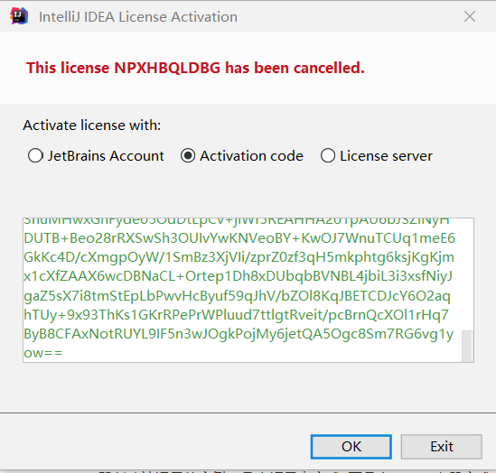
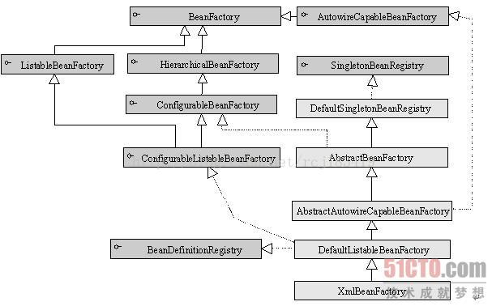
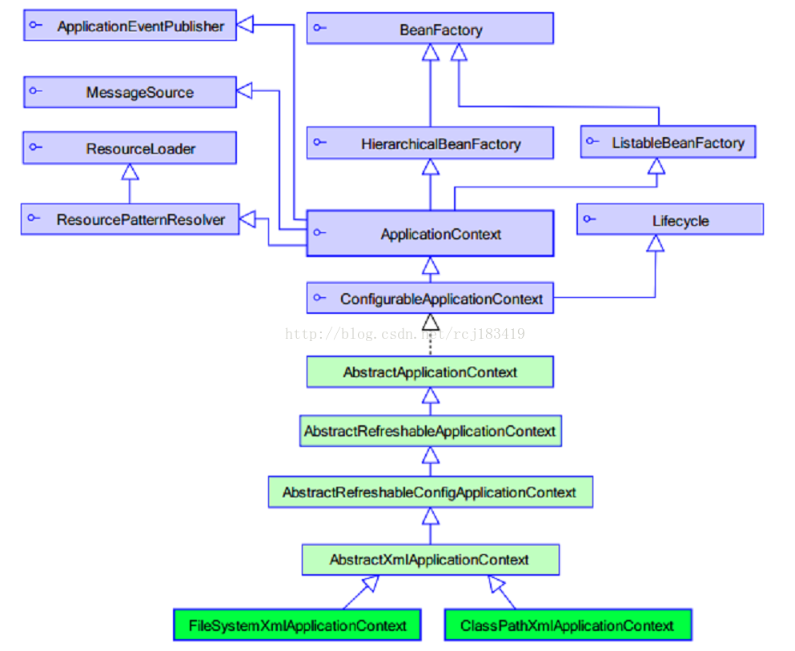
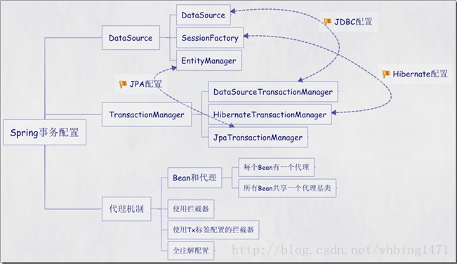

#  Spring 简介

##   1. 什么是Spring

### 1.1 Spring  介绍

> Spring框架是一个开放源代码的[J2EE](https://baike.baidu.com/item/J2EE/110838)应用程序框架，由[Rod Johnson](https://baike.baidu.com/item/Rod Johnson/1423612)发起，是针对bean的生命周期进行管理的轻量级容器（lightweight container）。 Spring解决了开发者在J2EE开发中遇到的许多常见的问题，提供了功能强大IOC、[AOP](https://baike.baidu.com/item/AOP/1332219)及Web MVC等功能。Spring可以单独应用于构筑应用程序，也可以和Struts、Webwork、Tapestry等众多Web框架组合使用，并且可以与 Swing等桌面应用程序AP组合。因此， Spring不仅仅能应用于JEE应用程序之中，也可以应用于桌面应用程序以及小应用程序之中。Spring框架主要由七部分组成，分别是 Spring Core、 Spring AOP、 Spring ORM、 Spring DAO、Spring Context、 Spring Web和 Spring Web MVC。--百度

### 1.2 设计者介绍

>  [Rod Johnson](https://baike.baidu.com/item/Rod Johnson/1423612) 是 Spring Framework创始人，著名作者。 Rod在[悉尼大学](https://baike.baidu.com/item/悉尼大学/1700805)不仅获得了计算机学位，同时还获得了音乐学位。更令人吃惊的是在回到软件开发领域之前，他还获得了音乐学的博士学位。 有着相当丰富的C/[C++](https://baike.baidu.com/item/C%2B%2B)技术背景的Rod早在1996年就开始了对Java服务器端技术的研究。他是一个在保险、电子商务和金融行业有着丰富经验的技术顾问，同时也是[JSR](https://baike.baidu.com/item/JSR)-154（[Servlet](https://baike.baidu.com/item/Servlet)2.4）和[JDO](https://baike.baidu.com/item/JDO)2.0的规范专家、[JCP](https://baike.baidu.com/item/JCP)的积极成员，是Java development community中的杰出人物。--百度

##   2. Spring 优点

1. Spring 可以使开发人员使用 POJOs 开发企业级的应用程序。只使用 POJOs 的好处是你不需要一个 EJB 容器产品，比如一个应用程序服务器，但是你可以选择使用一个健壮的 servlet 容器，比如 Tomcat 或者一些商业产品。Spring 在一个单元模式中是有组织的。即使包和类的数量非常大，你只要担心你需要的，而其它的就可以忽略了。

2. Spring 不会让你白费力气做重复工作，它真正的利用了一些现有的技术，像ORM 框架、日志框架、JEE、Quartz 和 JDK 计时器，其他视图技术。

3. 测试一个用 Spring 编写的应用程序很容易，因为环境相关的代码被移动到这个框架中。此外，通过使用 JavaBean-style POJOs，它在使用依赖注入注入测试数据时变得更容易。

4. Spring 的 web 框架是一个设计良好的 web MVC 框架，它为比如 Structs 或者其他工程上的或者不怎么受欢迎的 web 框架提供了一个很好的供替代的选择。MVC模式导致应用程序的不同方面(输入逻辑，业务逻辑和UI逻辑)分离，同时提供这些元素之间的松散耦合。

5. 模型(Model)封装了应用程序数据，通常它们将由POJO类组成。

6. 视图(View)负责渲染模型数据，一般来说它生成客户端浏览器可以解释HTML输出。

7. 控制器(Controller)负责处理用户请求并构建适当的模型，并将其传递给视图进行渲染。

8. Spring 对JavaEE开发中非常难用的一些API（JDBC、JavaMail、远程调用等），都提供了封装，使这些API应用难度大大降低。

9. 轻量级的 IOC 容器往往是轻量级的，例如，特别是当与 EJB 容器相比的时候。这有利于在内存和 CPU 资源有限的计算机上开发和部署应用程序。

10. Spring提供了一致的事务管理接口，可向下扩展到（使用一个单一的数据库，例如）本地事务并扩展到全局事务（例如，使用 JTA）。


## 3. Spring 框架大体内容


### 3.1 核心容器

核心容器由**spring-core，spring-beans，spring-context，spring-context-support和spring-expression**（SpEL，Spring表达式语言，Spring Expression Language）等模块组成，它们的细节如下：

- **spring-core**模块提供了框架的基本组成部分，包括 IoC 和依赖注入功能。
- **spring-beans** 模块提供 BeanFactory，工厂模式的微妙实现，它移除了编码式单例的需要，并且可以把配置和依赖从实际编码逻辑中解耦。
- **context**模块建立在由**core**和 **beans** 模块的基础上建立起来的，它以一种类似于JNDI注册的方式访问对象。Context模块继承自Bean模块，并且添加了国际化（比如，使用资源束）、事件传播、资源加载和透明地创建上下文（比如，通过Servelet容器）等功能。Context模块也支持Java EE的功能，比如EJB、JMX和远程调用等。**ApplicationContext**接口是Context模块的焦点。**spring-context-support**提供了对第三方库集成到Spring上下文的支持，比如缓存（EhCache, Guava, JCache）、邮件（JavaMail）、调度（CommonJ, Quartz）、模板引擎（FreeMarker, JasperReports, Velocity）等。
- **spring-expression**模块提供了强大的表达式语言，用于在运行时查询和操作对象图。它是JSP2.1规范中定义的统一表达式语言的扩展，支持set和get属性值、属性赋值、方法调用、访问数组集合及索引的内容、逻辑算术运算、命名变量、通过名字从Spring IoC容器检索对象，还支持列表的投影、选择以及聚合等。

它们的完整依赖关系如下图所示：


### 3.2  数据访问/集成

数据访问/集成层包括 JDBC，ORM，OXM，JMS 和事务处理模块，它们的细节如下：

（注：JDBC=Java Data Base Connectivity，ORM=Object Relational Mapping，OXM=Object XML Mapping，JMS=Java Message Service）

- **JDBC** 模块提供了JDBC抽象层，它消除了冗长的JDBC编码和对数据库供应商特定错误代码的解析。
- **ORM** 模块提供了对流行的对象关系映射API的集成，包括JPA、JDO和Hibernate等。通过此模块可以让这些ORM框架和spring的其它功能整合，比如前面提及的事务管理。
- **OXM** 模块提供了对OXM实现的支持，比如JAXB、Castor、XML Beans、JiBX、XStream等。
- **JMS** 模块包含生产（produce）和消费（consume）消息的功能。从Spring 4.1开始，集成了spring-messaging模块。。
- **事务**模块为实现特殊接口类及所有的 POJO 支持编程式和声明式事务管理。（注：编程式事务需要自己写beginTransaction()、commit()、rollback()等事务管理方法，声明式事务是通过注解或配置由spring自动处理，编程式事务粒度更细）

### 3.3 Web

Web 层由 Web，Web-MVC，Web-Socket 和 Web-Portlet 组成，它们的细节如下：

- **Web** 模块提供面向web的基本功能和面向web的应用上下文，比如多部分（multipart）文件上传功能、使用Servlet监听器初始化IoC容器等。它还包括HTTP客户端以及Spring远程调用中与web相关的部分。。
- **Web-MVC** 模块为web应用提供了模型视图控制（MVC）和REST Web服务的实现。Spring的MVC框架可以使领域模型代码和web表单完全地分离，且可以与Spring框架的其它所有功能进行集成。
- **Web-Socket** 模块为 WebSocket-based 提供了支持，而且在 web 应用程序中提供了客户端和服务器端之间通信的两种方式。
- **Web-Portlet** 模块提供了用于Portlet环境的MVC实现，并反映了spring-webmvc模块的功能。

### 3.4 其他

还有其他一些重要的模块，像 [AOP](https://www.w3cschool.cn/wkspring/izae1h9w.html)，Aspects，Instrumentation，Web 和测试模块，它们的细节如下：

- **AOP** 模块提供了面向方面的编程实现，允许你定义方法拦截器和切入点对代码进行干净地解耦，从而使实现功能的代码彻底的解耦出来。使用源码级的元数据，可以用类似于.Net属性的方式合并行为信息到代码中。
- **Aspects** 模块提供了与 **AspectJ** 的集成，这是一个功能强大且成熟的面向切面编程（AOP）框架。
- **Instrumentation** 模块在一定的应用服务器中提供了类 instrumentation 的支持和类加载器的实现。
- **Messaging** 模块为 STOMP 提供了支持作为在应用程序中 WebSocket 子协议的使用。它也支持一个注解编程模型，它是为了选路和处理来自 WebSocket 客户端的 STOMP 信息。
- **测试**模块支持对具有 JUnit 或 TestNG 框架的 Spring 组件的测试。


## 4.  重点学习 Spring 两大特性


### 1. AOP(面向切片编程)

### 2. Ioc—Inversion of Control，即“控制反转”

* IoC 不是一种技术，只是一种思想，一个重要的面向对象编程的法则，它能指导我们如何设计出松耦合、更优良的程序。传统应用程序都是由我们在类内部主动创建依赖对象，从而导致类与类之间高耦合，难于测试；有了IoC容器后，把创建和查找依赖对象的控制权交给了容器，由容器进行注入组合对象，所以对象与对象之间是 松散耦合，这样也方便测试，利于功能复用，更重要的是使得程序的整个体系结构变得非常灵活。

*  其实IoC对编程带来的最大改变不是从代码上，而是从思想上，发生了“主从换位”的变化。应用程序原本是老大，要获取什么资源都是主动出击，但是在IoC/DI思想中，应用程序就变成被动的了，被动的等待IoC容器来创建并注入它所需要的资源了。

* IoC很好的体现了面向对象设计法则之一—— 好莱坞法则：“别找我们，我们找你”；即由IoC容器帮对象找相应的依赖对象并注入，而不是由对象主动去找。

#### DI—Dependency Injection，即“依赖注入”

  理解DI的关键是：“谁依赖谁，为什么需要依赖，谁注入谁，注入了什么”，那我们来深入分析一下：

  * 谁依赖于谁：当然是应用程序依赖于IoC容器；
  * 为什么需要依赖：应用程序需要IoC容器来提供对象需要的外部资源；
  * 谁注入谁：很明显是IoC容器注入应用程序某个对象，应用程序依赖的对象；
  * 注入了什么：就是注入某个对象所需要的外部资源（包括对象、资源、常量数据）。


二者之间的 关系

 利用spring IOC实例化了对象，而DI将实例化的对象注入到需要对象的地方，完成初始化任务。


# 环境准备

## 1. 工具的准备

Java jdk 配置  [csdn](https://blog.csdn.net/wujing1_1/article/details/100047055)

IDEA 安装 [官网](https://www.jetbrains.com/)

[破解码](http://idea.medeming.com/jet/)  

[Tomcat 下载安装](https://tomcat.apache.org/download-90.cgi) ( Tomcat 8 以后就不需要配置环境变量，直接解压即可食用，口味极佳)


## 2. 技术的前提

c语言--C#--java -jsp+servlet--html+css+javascript--bookstrap--RDBMS--ssm-springboot--springcloud-hadoop

Java 基础 

Java EE 基础 ,掌握servlet+jsp

html+css+javascript


## 3. Spring 官网，jar 包准备

官网 https://spring.io/

[jar 包准备](https://repo.spring.io/release/org/springframework/spring/) 选择 最新的版本

> spring  所需要jar 包
>
> junit 测试包(版本过高 会有影响)
>
> mysql-java-8 或者mysql-java-5 看你电脑上mysql 版本 不要盲目选择，不然汇报bug
>
> druid

**测试junit 包 junit 4.12 以上需要hamcrest-core-1.3**

mysql-java 版本根据你的 自己数据选择

我的数据源选择的是 的阿里巴巴的druid ,也可以选择c3p0 看个人爱好

## 4. 一些学习网站的推荐 

* [github](https://github.com/)
* [w3school](https://www.w3school.com.cn/)  全球最大的中文 Web 技术教程
* [菜鸟教程](https://www.runoob.com/)
* [csdn](https://www.csdn.net/)
* [w3cschool](https://www.w3cschool.cn/)
* [我要自学网](https://www.51zxw.net/)
* [我的大 B站](https://www.bilibili.com/)
* [慕课](https://www.icourse163.org/)
* [腾讯云](https://cloud.tencent.com/developer)  
* [博客园](https://www.cnblogs.com/)
* [源码之家](http://www.verysource.com/)


## 5. 工具网站推荐

[maven工具](https://mvnrepository.com/) 缺少什么jar 包都是从这里下载

还有几个学习机构推荐

* 尚硅谷
* 黑马程序员
* 千峰教育
* 传智播客
* java1234
* 北大青鸟


# Spring 入门

JavaEE规范的三层结构体系：

*  表现层（页面数据显示、页面跳转调度）jsp/servlet    springmvc

* 业务层（业务处理和功能逻辑、事务控制）-service   spring

*  持久层（数据存取和封装、和数据库打交道）dao  mybatis

Spring 属于 service 

## Spring IOC 讲解

**IOC 容器**具有依赖注入功能的容器，它可以创建对象，IOC 容器负责实例化、定位、配置应用程序中的对象及建立这些对象间的依赖。通常new一个实例，控制权由程序员控制，而"控制反转"是指new实例工作不由程序员来做而是交给Spring容器来做。在Spring中BeanFactory是IOC容器的实际代表者。Spring 提供了两个最基本的容器 BeanFactory,ApplicationContext

### 1. (不推荐) BeanFactory ----项目的创建

结构如下



#### 1.1 创建新的工程


#### 1.2 在 WEB-INF 下面创建 classes 和 lib 文件夹 


#### 1.3 然后把jar 包放入其中

* 点击File -> Project Setting ,点击Modules -> Paths ，把 outpath  全部变成class

  

* 点击 dependencies 添加依赖

  

  

  

* 前期准备就都准备完毕，然后创建 src 下面创建 java,resource,Test 三个目录(如果创建不了，右键点击Mark Directory as)

  java  天蓝色 表示的是 放package 的地方

  resource 灰色 表示资源地方，一般放置html,css 的地方

  Test 绿色 表示进行测试的地方

  **一定要进行mark directory as **
  
  

#### 1.4 创建实体类

~~~java

public class Person {
    private int id;
    private String name;
    private Double score;

    @Override
    public String toString() {
        return "Person{" +
                "id=" + id +
                ", name='" + name + '\'' +
                ", score=" + score +
                '}';
    }

    public int getId() {
        return id;
    }

    public void setId(int id) {
        this.id = id;
    }

    public String getName() {
        return name;
    }

    public void setName(String name) {
        this.name = name;
    }

    public Double getScore() {
        return score;
    }

    public void setScore(Double score) {
        this.score = score;
    }
}

~~~


  #### 1.5 创建 ApplicationContext.xml

~~~xml
<?xml version="1.0" encoding="UTF-8"?>
<beans xmlns="http://www.springframework.org/schema/beans"
       xmlns:xsi="http://www.w3.org/2001/XMLSchema-instance"
       xmlns:context="http://www.springframework.org/schema/context"
       xsi:schemaLocation="http://www.springframework.org/schema/beans
    http://www.springframework.org/schema/beans/spring-beans-3.0.xsd http://www.springframework.org/schema/context https://www.springframework.org/schema/context/spring-context.xsd">

    <!--
	id: bean的唯一标识
	class: 指定全类名，以反射的方式创建对象 Class.forName("com.ak.Pojo.Person").newInstance();
 -->
<!--
property 表示的是 自动注入的属性 ，一个property 对应一个 属性
name 表示字段名称 value 表示 字段值 
property 下面没有其他字段内容
-->

    <bean id="helloWorld" class="com.ak.Pojo.Person">
        <property name="name" value="joker"/>
        <property name="id" value="1"></property>
        <property name="score" value="100"></property>
    </bean>

</beans>
~~~

#### 1.6 创建MyTest.class，进行测试

右键点击运行 kk

```java
package com.ak;

import com.ak.Pojo.Person;
import org.junit.Before;
import org.junit.Test;
import org.springframework.beans.factory.xml.XmlBeanFactory;
import org.springframework.context.support.ClassPathXmlApplicationContext;
import org.springframework.core.io.ClassPathResource;

/**
 * 名字千万不要起Test会出现一系列的冲突 ，MyTest就可以
 */
public class MyTest {

    XmlBeanFactory factory;
    ClassPathXmlApplicationContext classPathXmlApplicationContext;

    @Before
    public void Before(){
        factory= new XmlBeanFactory
                (new ClassPathResource("ApplicationContext.xml"));
    }

    @Test
    public  void kk(){
        Person person=(Person)factory.getBean("helloWorld");
        System.out.println(person);
    }

}
```

  #### 1.7 bean 的讲解

#####  1.7.1 定义

| 属性                     | 描述                                                         |
| ------------------------ | ------------------------------------------------------------ |
| class                    | 这个属性是强制性的，并且指定用来创建 bean 的 bean 类。       |
| name                     | 这个属性指定唯一的 bean 标识符。在基于 XML 的配置元数据中，你可以使用 ID 和/或 name 属性来指定 bean 标识符。 |
| scope                    | 这个属性指定由特定的 bean 定义创建的对象的作用域，它将会在 bean 作用域的章节中进行讨论。 |
| constructor-arg          | 它是用来注入依赖关系的，并会在接下来的章节中进行讨论。       |
| properties               | 它是用来注入依赖关系的，并会在接下来的章节中进行讨论。       |
| autowiring mode          | 它是用来注入依赖关系的，并会在接下来的章节中进行讨论。       |
| lazy-initialization mode | 延迟初始化的 bean 告诉 IoC 容器在它第一次被请求时，而不是在启动时去创建一个 bean 实例。 |
| initialization 方法      | 在 bean 的所有必需的属性被容器设置之后，调用回调方法。它将会在 bean 的生命周期章节中进行讨论。 |
| destruction 方法         | 当包含该 bean 的容器被销毁时，使用回调方法。它将会在 bean 的生命周期章节中进行讨论。 |

##### 1.7.2 bean 的作用域

Spring 框架支持以下五个作用域，分别为singleton、prototype、request、session和global session，5种作用域说明如下所示，

注意，如果你使用 web-aware ApplicationContext 时，其中三个是可用的。   

| 作用域         | 描述                                                         |
| -------------- | ------------------------------------------------------------ |
| singleton      | 在spring IoC容器仅存在一个Bean实例，Bean以单例方式存在，默认值 |
| prototype      | 每次从容器中调用Bean时，都返回一个新的实例，即每次调用getBean()时，相当于执行newXxxBean() |
| request        | 每次HTTP请求都会创建一个新的Bean，该作用域仅适用于WebApplicationContext环境 |
| session        | 同一个HTTP Session共享一个Bean，不同Session使用不同的Bean，仅适用于WebApplicationContext环境 |
| global-session | 一般用于Portlet应用环境，该运用域仅适用于WebApplicationContext环境 |

singleton 是默认的作用域，也就是说，当定义 Bean 时，如果没有指定作用域配置项，则 Bean 的作用域被默认为 singleton。

当一个bean的作用域为Singleton，那么Spring IoC容器中只会存在一个共享的bean实例，并且所有对bean的请求，只要id与该bean定义相匹配，则只会返回bean的同一实例。

也就是说，当将一个bean定义设置为singleton作用域的时候，Spring IoC容器只会创建该bean定义的唯一实例。


#####  1.7.3 bean 的生命周期

Bean的生命周期可以表达为：Bean的定义——Bean的初始化——Bean的使用——Bean的销毁

#####  1.7.4  代码展示

* 创建两个实体类 HelloWorld 

~~~java

/**
 * 使用 属性的方式来 初始化的回调
 */
public class HelloWorld {
    private String Message;
    private int code;

    @Override
    public String toString() {
        return "HelloWorld{" +
                "Message='" + Message + '\'' +
                ", code=" + code +
                '}';
    }

    public int getCode() {
        return code;
    }

    public void setCode(int code) {
        this.code = code;
    }

    public String getMessage() {
        return Message;
    }

    public void setMessage(String message) {
        Message = message;
    }

    public void init(){
        System.out.println("属性方式 的Hello World 初始化开始"+this.hashCode());
        this.Message="init() 初始化的信息";
        this.code=300;
    }

    public void destory(){
        System.out.println("属性方式的 Hello World 销毁");
        this.Message=null;
        this.code=0;
    }

}

~~~

 HelloWorld2

~~~java

import org.springframework.beans.factory.DisposableBean;
import org.springframework.beans.factory.InitializingBean;

/**
 * 继承了 接口的话，也会实现 初始化 的 回调
 */
public class HelloWorld2 implements InitializingBean, DisposableBean {

    private String Message;
    private int code;

    @Override
    public String toString() {
        return "HelloWorld2{" +
                "Message='" + Message + '\'' +
                ", code=" + code +
                '}';
    }

    public int getCode() {
        return code;
    }

    public void setCode(int code) {
        this.code = code;
    }

    public String getMessage() {
        return Message;
    }

    public void setMessage(String message) {
        Message = message;
    }

    @Override
    public void destroy() throws Exception {
        System.out.println("继承接口的 初始化");
    }

    @Override
    public void afterPropertiesSet() throws Exception {
        this.Message="afterPropertiesSet() 初始化的信息";
        this.code=300;
    }
}

~~~


* 创建PropertiesContext.xml

  ~~~xml
  <?xml version="1.0" encoding="UTF-8"?>
  
  <beans xmlns="http://www.springframework.org/schema/beans"
         xmlns:xsi="http://www.w3.org/2001/XMLSchema-instance"
         xsi:schemaLocation="http://www.springframework.org/schema/beans
      http://www.springframework.org/schema/beans/spring-beans-3.0.xsd">
  
      <!-- A simple bean definition -->
      <bean id="configuration" class="com.ak.Pojo.HelloWorld"  lazy-init="true" >
          <property name="message" value="这个是xml 中初始化 的数据"></property>
          <property name="code" value="200"></property>
      </bean>
  
  <!--   这个是 每次调用 都次调用 getbean ,都会使用 new  -->
      <bean id="coll" class="com.ak.Pojo.HelloWorld" scope="prototype">
          <property name="message" value="这个是xml 中初始化 的数据"></property>
          <property name="code" value="400"></property>
      </bean>
  
  <!--   这个是 接口 进行的初始化-->
      <bean id="helloWorld" class="com.ak.Pojo.HelloWorld" init-method="init" destroy-method="destory">
          <property name="message" value="这个是xml 中初始化 的数据"></property>
          <property name="code" value="600"></property>
      </bean>
  
        <!-- 这个是 属性的进行的初始化 -->
      <bean id="helloWorld2" class="com.ak.Pojo.HelloWorld2" >
          <property name="message" value="这个是xml 中初始化 的数据"></property>
          <property name="code" value="700"></property>
      </bean>
  
  
  </beans>
  ~~~


* Test类

  ~~~java
  package com.ak;
  
  import com.ak.Pojo.HelloWorld;
  import com.ak.Pojo.HelloWorld2;
  import com.ak.Pojo.Person;
  import org.junit.Test;
  import org.springframework.context.ApplicationContext;
  import org.springframework.context.support.ClassPathXmlApplicationContext;
  
  public class PropertiesTest {
  
      @Test
      public void  kk(){
          ApplicationContext context=new ClassPathXmlApplicationContext("PropertiesContext.xml");
  
          HelloWorld helloWorld=new HelloWorld();
          HelloWorld2 helloWorld2=new HelloWorld2();
  
        // 这个是测试 scoped 属性
          helloWorld=(HelloWorld)context.getBean("coll");
          System.out.println(helloWorld+"-----"+helloWorld.hashCode());
          helloWorld.setMessage("修改过了");
          System.out.println(helloWorld+"----"+helloWorld.hashCode());
          helloWorld=(HelloWorld)context.getBean("coll");
          System.out.println(helloWorld+"----"+helloWorld.hashCode());
          System.out.println();
  
          // 测试 init-method,一个是使用了 init-method ,一个是使用了接口
          helloWorld=(HelloWorld)context.getBean("helloWorld");
          System.out.println(helloWorld+"----"+helloWorld.hashCode());
  
          helloWorld2=(HelloWorld2)context.getBean("helloWorld2");
          System.out.println(helloWorld2);
  
  
      }
  }
  
  ~~~

  

### 2. (推荐)ApplicationContext

结构如下



* Application Context 是 BeanFactory 的子接口，也被称为 Spring 上下文。

* Application Context 是 spring 中较高级的容器。和 BeanFactory 类似，它可以加载配置文件中定义的 bean，将所有的 bean 集中在一起，当有请求的时候分配 bean。 另外，它增加了企业所需要的功能，比如，从属性文件中解析文本信息和将事件传递给所指定的监听器。这个容器在 org.springframework.context.ApplicationContext interface 接口中定义。

* ApplicationContext 包含 BeanFactory 所有的功能，一般情况下，相对于 BeanFactory，ApplicationContext 会更加优秀。当然，BeanFactory 仍可以在轻量级应用中使用，比如移动设备或者基于 applet 的应用程序。

最常被使用的 ApplicationContext 接口实现：

- **FileSystemXmlApplicationContext**：该容器从 XML 文件中加载已被定义的 bean。在这里，你需要提供给构造器 XML 文件的完整路径。

- **ClassPathXmlApplicationContext**：该容器从 XML 文件中加载已被定义的 bean。在这里，你不需要提供 XML 文件的完整路径，只需正确配置 CLASSPATH 环境变量即可，因为，容器会从 CLASSPATH 中搜索 bean 配置文件。

- **WebXmlApplicationContext**：该容器会在一个 web 应用程序的范围内加载在 XML 文件中已被定义的 bean。

----来源于 w3school 


#### 1. 代码展示  修改MyTest 即可食用

~~~java

import com.ak.Pojo.Person;
import org.junit.Before;
import org.junit.Test;
import org.springframework.beans.factory.xml.XmlBeanFactory;
import org.springframework.context.ApplicationContext;
import org.springframework.context.support.ClassPathXmlApplicationContext;
import org.springframework.context.support.FileSystemXmlApplicationContext;
import org.springframework.core.io.ClassPathResource;

/**
 * 名字 千万不要起Test ，比如MyTest 啥的
 */
public class MyTest {

    XmlBeanFactory factory;
    ApplicationContext classPathXmlApplicationContext_ClassPathxml;
    ApplicationContext classPathXmlApplicationContext_FileSystemXml;

    @Before
    public void Before(){
        factory= new XmlBeanFactory
                (new ClassPathResource("ApplicationContext.xml"));
       classPathXmlApplicationContext_ClassPathxml= new ClassPathXmlApplicationContext("applicationContext.xml");
    classPathXmlApplicationContext_FileSystemXml=new FileSystemXmlApplicationContext("C:\\Users\\bn\\Desktop\\ssm\\spring\\code\\demo1\\src\\resource\\ApplicationContext.xml");

    }

    /**
     * 方式一 BeanFactory
     */
    @Test
    public  void kk(){
        Person person=(Person)factory.getBean("helloWorld");
        System.out.println(person);
    }

    /**
     * 方式二 ApplicationContext
     */
    @Test
    public void k2(){
        Person person=(Person)classPathXmlApplicationContext_ClassPathxml.getBean("helloWorld");
        System.out.println(person);

        Person person1=(Person)classPathXmlApplicationContext_FileSystemXml.getBean("helloWorld");
        System.out.println(person1);
    }

}

~~~

**结果**

~~~xml
Person{id=1, name='joker', score=100.0}
Person{id=1, name='joker', score=100.0}
~~~

####  2. 问题---三者的区别

Spring的三大核心接口——BeanFactory、ApplicationContext、WebApplicationContext 之间的区别

> BeanFactory和ApplicationContext初始化区别：
>
> BeanFactory在初始化容器时并没有实例化Bean，而是在第一次访问到目标Bean时才实例化该Bean；而ApplicationContext会在初始化上下文时实例化所有的单例的Bean。
>
> WebApplicationContext和BeanFactory、ApplicationContext初始化的区别：WebApplicationContext的初始化需要servletContext实例，即初始化需要拥有web容器，我们需要在web.xml中配置自启动的servlet或web容器监听器（servletContextListener）。
>
> 2、Bean的作用域
>
> 在BeanFactory和ApplicationContext中的Bean的作用域有两种：singleton和prototype，在WebApplicationContext中的Bean的作用域有三种：request，session和globalSession。
> singleton：在IOC容器中仅存在一个Bean实例，Bean以单例方式存在，外部引用都指向这个Bean。
> prototype：每次调用Bean都返回一个新实例。
> request：在同一个Http请求的Bean相同，每个Http请求创建一个新的Bean。
> session：在Http请求对应同一个session时对应同一个Bean。
> globalSession：一般的web应用中globalSession等价于session，只有在portlet web应用中才存在globalSession概念。


### 3. 注解的方式

#### 3.1 属性注解

#### 3.2 类注解


### 4. 基于java 方式( 配置类)--不要xml ，归属于 注解类

SpringBoot 最常用的


## Spring 的DI 依赖注入

### 1. 基于 构造函数--constructor-arg

* **Person 要记得添加构造函数 **,修改Person 属性

~~~java

public class Person {
    private int id;
    private String name;
    private Double score;

    public Person() {
    }

    public Person(int id, String name, Double score) {
        this.id = id;
        this.name = name;
        this.score = score;
    }

    public Person(Person person) {
        this.score=person.score;
        this.name=person.name;
        this.id=person.id;
    }

    @Override
    public String toString() {
        return "Person{" +
                "id=" + id +
                ", name='" + name + '\'' +
                ", score=" + score +
                '}';
    }

    public int getId() {
        return id;
    }

    public void setId(int id) {
        this.id = id;
    }

    public String getName() {
        return name;
    }

    public void setName(String name) {
        this.name = name;
    }

    public Double getScore() {
        return score;
    }

    public void setScore(Double score) {
        this.score = score;
    }
}

~~~


* 创建Context_3.xml

  ~~~xml
  <?xml version="1.0" encoding="UTF-8"?>
  <beans xmlns="http://www.springframework.org/schema/beans"
         xmlns:xsi="http://www.w3.org/2001/XMLSchema-instance"
         xmlns:context="http://www.springframework.org/schema/context"
         xsi:schemaLocation="http://www.springframework.org/schema/beans
      http://www.springframework.org/schema/beans/spring-beans-3.0.xsd http://www.springframework.org/schema/context https://www.springframework.org/schema/context/spring-context.xsd">
  
  <!-- 用来测试 Spring 依赖注入的 地方-->
      <bean id="person_index" class="com.ak.Pojo.Person">
         <constructor-arg index="0" value="1"></constructor-arg>
          <constructor-arg index="1" value="joker-construct"></constructor-arg>
          <constructor-arg index="2" value="99"></constructor-arg>
      </bean>
  
      <bean id="person_type" class="com.ak.Pojo.Person">
          <constructor-arg type="int" value="1"></constructor-arg>
          <constructor-arg type="java.lang.String" value="joker-type"></constructor-arg>
          <constructor-arg type="java.lang.Double" value="99.0"></constructor-arg>
      </bean>
  
      <bean id="person_ref" class="com.ak.Pojo.Person">
         <constructor-arg ref="person_index"></constructor-arg>
      </bean>
  
  </beans>
  ~~~

  

* 创建 Context_3 测试

  ~~~java
  package com.ak;
  
  import com.ak.Pojo.Person;
  import org.junit.Test;
  import org.springframework.context.ApplicationContext;
  import org.springframework.context.support.ClassPathXmlApplicationContext;
  
  public class Context_3 {
  
      @Test
      public  void kk(){
          ApplicationContext context=new ClassPathXmlApplicationContext("Context_3.xml");
          Person person=new Person();
          person=(Person)context.getBean("person_index");
          System.out.println(person);
          person=(Person)context.getBean("person_type");
          System.out.println(person);
          person=(Person)context.getBean("person_ref");
          System.out.println(person);
      }
  }
  
  ~~~

* 结果

  ~~~
  Person{id=1, name='joker-construct', score=99.0}
  Person{id=1, name='joker-type', score=99.0}
  Person{id=1, name='joker-construct', score=99.0}
  ~~~

  

项目结构


* construct-args 中的一些属性

  **index** :索引，指定注入的属性，从0开始
  **name** 构造器参数名
  **type**是指该属性所对应的类型；
  **ref** 是指引用的依赖对象；
  **value** 当注入的不是依赖对象，而是基本数据类型时，就用value；

### 2. 基于设值函数--property

 **类里面一定要有getter-setter**

* 添加xml

  ~~~xml
  <?xml version="1.0" encoding="UTF-8"?>
  <beans xmlns="http://www.springframework.org/schema/beans"
         xmlns:xsi="http://www.w3.org/2001/XMLSchema-instance"
         xmlns:p="http://www.springframework.org/schema/p"
         xmlns:context="http://www.springframework.org/schema/context"
         xsi:schemaLocation="http://www.springframework.org/schema/beans
      http://www.springframework.org/schema/beans/spring-beans-3.0.xsd http://www.springframework.org/schema/context https://www.springframework.org/schema/context/spring-context.xsd">
  
  <!-- 用来测试 Spring 依赖注入的 地方-->
      <bean id="person_index" class="com.ak.Pojo.Person">
         <constructor-arg index="0" value="1"></constructor-arg>
          <constructor-arg index="1" value="joker-construct"></constructor-arg>
          <constructor-arg index="2" value="99"></constructor-arg>
      </bean>
  
      <bean id="person_type" class="com.ak.Pojo.Person">
          <constructor-arg type="int" value="1"></constructor-arg>
          <constructor-arg type="java.lang.String" value="joker-type"></constructor-arg>
          <constructor-arg type="java.lang.Double" value="99.0"></constructor-arg>
      </bean>
  
      <bean id="person_ref" class="com.ak.Pojo.Person">
         <constructor-arg ref="person_index"></constructor-arg>
      </bean>
  
      <bean id="person" class="com.ak.Pojo.Person">
          <property name="name" value="joker-person"/>
          <property name="id" value="12"></property>
          <property name="score" value="99"></property>
      </bean>
  
      <bean id="person_p" class="com.ak.Pojo.Person"
      p:name="p-person" p:id="12" p:score="110">
      </bean>
  
  
  </beans>
  ~~~

  

* 添加测试代码

  ~~~
  
  import com.ak.Pojo.Person;
  import org.junit.Before;
  import org.junit.Test;
  import org.springframework.context.ApplicationContext;
  import org.springframework.context.support.ClassPathXmlApplicationContext;
  
  public class Context_3 {
      ApplicationContext context;
      Person person=new Person();
  
      @Before
      public void Before(){
          context=new ClassPathXmlApplicationContext("Context_3.xml");
      }
      /**
       * 基于构造函数依赖注入
       */
      @Test
      public  void kk(){
  
  
          person=(Person)context.getBean("person_index");
          System.out.println(person);
          person=(Person)context.getBean("person_type");
          System.out.println(person);
          person=(Person)context.getBean("person_ref");
          System.out.println(person);
      }
  
      /**
       * 基于 设置函数，就是普通的，罪常见的注入方式
       */
      @Test
      public void k1(){
         person=(Person)context.getBean("person");
         System.out.println(person);
  
         person=(Person)context.getBean("person");
         System.out.println(person);
  
          person=(Person)context.getBean("person_p");
          System.out.println(person);
  
      }
  }
  
  ~~~


**注意使用p 标签时 ，需要添加约束规则**

~~~xml
xmlns:p="http://www.springframework.org/schema/p"
~~~

如果你要把一个引用传递给一个对象，那么你需要使用 标签的 **ref** 属性，而如果你要直接传递一个值，那么你应该使用 **value** 属性。


### 3. 注入内部 Beans--- 注入其他类 Order(订单) 类有 Person 

* 创建实体类 Text

  ~~~java
  
  public class Text {
      private String text;
      private Size size;
      private int length;
  
      @Override
      public String toString() {
          return "Text{" +
                  "text='" + text + '\'' +
                  ", size=" + size +
                  ", length=" + length +
                  '}';
      }
  
      public String getText() {
          return text;
      }
  
      public void setText(String text) {
          this.text = text;
      }
  
      public Size getSize() {
          return size;
      }
  
      public void setSize(Size size) {
          this.size = size;
      }
  
      public int getLength() {
          return length;
      }
  
      public void setLength(int length) {
          this.length = length;
      }
  
  
      public static class Size{
              private String name;
  
              @Override
              public String toString() {
                  return "color{" +
                          "name='" + name + '\'' +
                          '}';
              }
  
              public String getName() {
                  return name;
              }
  
              public void setName(String name) {
                  this.name = name;
              }
          }
  }
  
  ~~~

  

* 创建新的 Context_3.xml

  ~~~
  <?xml version="1.0" encoding="UTF-8"?>
  <beans xmlns="http://www.springframework.org/schema/beans"
         xmlns:xsi="http://www.w3.org/2001/XMLSchema-instance"
         xmlns:p="http://www.springframework.org/schema/p"
         xmlns:context="http://www.springframework.org/schema/context"
         xsi:schemaLocation="http://www.springframework.org/schema/beans
      http://www.springframework.org/schema/beans/spring-beans-3.0.xsd http://www.springframework.org/schema/context https://www.springframework.org/schema/context/spring-context.xsd">
  
  <!-- 用来测试 Spring 依赖注入的 地方-->
      <bean id="person_index" class="com.ak.Pojo.Person">
         <constructor-arg index="0" value="1"></constructor-arg>
          <constructor-arg index="1" value="joker-construct"></constructor-arg>
          <constructor-arg index="2" value="99"></constructor-arg>
      </bean>
  
      <bean id="person_type" class="com.ak.Pojo.Person">
          <constructor-arg type="int" value="1"></constructor-arg>
          <constructor-arg type="java.lang.String" value="joker-type"></constructor-arg>
          <constructor-arg type="java.lang.Double" value="99.0"></constructor-arg>
      </bean>
  
      <bean id="person_ref" class="com.ak.Pojo.Person">
         <constructor-arg ref="person_index"></constructor-arg>
      </bean>
  
      <bean id="person" class="com.ak.Pojo.Person">
          <property name="name" value="joker-person"/>
          <property name="id" value="12"></property>
          <property name="score" value="99"></property>
      </bean>
  
      <bean id="person_p" class="com.ak.Pojo.Person"
      p:name="p-person" p:id="12" p:score="110">
      </bean>
  
  
  
      <bean id="Text" class="com.ak.Pojo.Text">
          <property name="size">
              <bean id="Size" class="com.ak.Pojo.Text.Size">
                  <property name="name" value="Size_Name"></property>
              </bean>
          </property>
          <property name="length" value="10000">
  
          </property>
          <property name="text" value="Text"></property>
      </bean>
  </beans>
  ~~~


* 添加Context_3 测试

  ~~~java
  import com.ak.Pojo.Person;
  import com.ak.Pojo.Text;
  import org.junit.Before;
  import org.junit.Test;
  import org.springframework.context.ApplicationContext;
  import org.springframework.context.support.ClassPathXmlApplicationContext;
  
  public class Context_3 {
      ApplicationContext context;
      Person person=new Person();
  
      @Before
      public void Before(){
          context=new ClassPathXmlApplicationContext("Context_3.xml");
      }
      /**
       * 基于构造函数依赖注入
       */
      @Test
      public  void kk(){
  
  
          person=(Person)context.getBean("person_index");
          System.out.println(person);
          person=(Person)context.getBean("person_type");
          System.out.println(person);
          person=(Person)context.getBean("person_ref");
          System.out.println(person);
      }
  
      /**
       * 基于 设置函数，就是普通的，罪常见的注入方式
       */
      @Test
      public void k1(){
         person=(Person)context.getBean("person");
         System.out.println(person);
  
         person=(Person)context.getBean("person");
         System.out.println(person);
  
          person=(Person)context.getBean("person_p");
          System.out.println(person);
  
      }
  
      /**
       * 内部注入bean
       */
      @Test
      public void  k2(){
          Text text=new Text();
          text=(Text)context.getBean("Text");
          System.out.println(text);
      }
  }
  
  ~~~

* 结果

  ~~~
  Text{text='Text', size=color{name='Size_Name'}, length=10000}
  ~~~

* 项目结构

  

### 4. 集合注入--java 的复杂格式(list,set,map)

* 创建测试类 D_4

~~~java

import java.util.List;
import java.util.Map;
import java.util.Properties;
import java.util.Set;

public class D_4 {
    private List<String> list;
    private Set<String> set;
    private Map map;
    private Properties addressProp;

    @Override
    public String toString() {
        return "D_4{" +
                "list=" + list +
                ", set=" + set +
                ", map=" + map +
                ", addressProp=" + addressProp +
                '}';
    }

    public Properties getAddressProp() {
        return addressProp;
    }

    public void setAddressProp(Properties addressProp) {
        this.addressProp = addressProp;
    }

    public List<String> getList() {
        return list;
    }

    public void setList(List<String> list) {
        this.list = list;
    }

    public Set<String> getSet() {
        return set;
    }

    public void setSet(Set<String> set) {
        this.set = set;
    }

    public Map getMap() {
        return map;
    }

    public void setMap(Map map) {
        this.map = map;
    }
}

~~~

* 添加bean 信息

  ~~~xml
   <!-- Definition for javaCollection -->
      <bean id="java_Collection" class="com.ak.Pojo.D_4">
  
          <!-- results in a setAddressList(java.util.List) call -->
          <property name="list">
              <list>
                  <value>INDIA</value>
                  <value>Pakistan</value>
                  <value>USA</value>
                  <value>USA</value>
              </list>
          </property>
  
          <!-- results in a setAddressSet(java.util.Set) call -->
          <property name="set">
              <set>
                  <value>INDIA</value>
                  <value>Pakistan</value>
                  <value>USA</value>
                  <value>USA</value>
              </set>
          </property>
  
          <!-- results in a setAddressMap(java.util.Map) call -->
          <property name="map">
              <map>
                  <entry key="1" value="INDIA"/>
                  <entry key="2" value="Pakistan"/>
                  <entry key="3" value="USA"/>
                  <entry key="4" value="USA"/>
              </map>
          </property>
  
          <!-- results in a setAddressProp(java.util.Properties) call -->
          <property name="addressProp">
              <props>
                  <prop key="one">INDIA</prop>
                  <prop key="two">Pakistan</prop>
                  <prop key="three">USA</prop>
                  <prop key="four">USA</prop>
              </props>
          </property>
  
      </bean>
  ~~~

  

* 添加测试

  ~~~java
    /**
       * 注入集合
       */
      @Test
      public void  k3(){
          D_4 d_4=new D_4();
          d_4=(D_4)context.getBean("java_Collection");
          System.out.println(d_4);
      }
  ~~~

  

## Spring 的自动装配

由于在手动配置xml过程中，常常发生字母缺漏和大小写等错误，而无法对其进行检查，使得开发效率降低。采用自动装配将避免这些错误，并且使配置简单化。和后面的注解方式息息相关 

### 1. ByName----根据bean的 id 或者name

* 创建实体类

  ~~~java
  
  public class Text {
      private String text;
      private Size size;
      private int length;
  
      @Override
      public String toString() {
          return "Text{" +
                  "text='" + text + '\'' +
                  ", size=" + size +
                  ", length=" + length +
                  '}';
      }
  
      public String getText() {
          return text;
      }
  
      public void setText(String text) {
          this.text = text;
      }
  
      public Size getSize() {
          return size;
      }
  
      public void setSize(Size size) {
          this.size = size;
      }
  
      public int getLength() {
          return length;
      }
  
      public void setLength(int length) {
          this.length = length;
      }
  
  
      public static class Size{
              private String name;
  
              @Override
              public String toString() {
                  return "color{" +
                          "name='" + name + '\'' +
                          '}';
              }
  
              public String getName() {
                  return name;
              }
  
              public void setName(String name) {
                  this.name = name;
              }
          }
  }
  
  ~~~

* 创建 Context_4.xml

  ~~~xml
  <?xml version="1.0" encoding="UTF-8"?>
  <beans xmlns="http://www.springframework.org/schema/beans"
         xmlns:xsi="http://www.w3.org/2001/XMLSchema-instance"
         xmlns:p="http://www.springframework.org/schema/p"
         xmlns:context="http://www.springframework.org/schema/context"
         xsi:schemaLocation="http://www.springframework.org/schema/beans
      http://www.springframework.org/schema/beans/spring-beans-3.0.xsd http://www.springframework.org/schema/context https://www.springframework.org/schema/context/spring-context.xsd">
  
      <bean id="Text_Auto_ByName" class="com.ak.Pojo.Text" autowire="byName">
          <property name="text" value="自动装配测试"></property>
          <property name="length" value="100"></property>
      </bean>
  
      <bean id="size" class="com.ak.Pojo.Text.Size">
          <property name="name" value="自动装配的Size"></property>
      </bean>
  
  <!--    使用了 自动装配的ByName  错误示范 ,id 的名字写错了 ，Size 写成大写，很容易失误 -->
  <!--    <bean id="Size" class="com.ak.Pojo.Text.Size">-->
  <!--        <property name="name" value="自动装配的Size"></property>-->
  <!--    </bean>-->
  
  
  
  </beans>
  ~~~

* 创建测试类 Context_4.java

  ~~~java
  
  import com.ak.Pojo.Text;
  import org.junit.Before;
  import org.junit.Test;
  import org.springframework.context.ApplicationContext;
  import org.springframework.context.support.ClassPathXmlApplicationContext;
  
  /**
   * 自动装配的测试类
   * 和下面的 注解方式
   */
  public class Context_4 {
      ApplicationContext context;
  
      @Before
      public void Before(){
          context=new ClassPathXmlApplicationContext("Context_4.xml");
      }
  
      @Test
      public void kk(){
          Text text=new Text();
          text=(Text)context.getBean("Text_Auto_ByName");
          System.out.println(text);
      }
  }
  
  ~~~

  

### 2. ByType--- 根据bean 的class

* 创建实体类Test

* 创建Context_5.xml

  ~~~xml
  <?xml version="1.0" encoding="UTF-8"?>
  <beans xmlns="http://www.springframework.org/schema/beans"
         xmlns:xsi="http://www.w3.org/2001/XMLSchema-instance"
         xmlns:p="http://www.springframework.org/schema/p"
         xmlns:context="http://www.springframework.org/schema/context"
         xsi:schemaLocation="http://www.springframework.org/schema/beans
      http://www.springframework.org/schema/beans/spring-beans-3.0.xsd http://www.springframework.org/schema/context https://www.springframework.org/schema/context/spring-context.xsd">
  
      <!-- 使用的条件  是根据类型的自动 匹配 ，所以每一种类 只能够有一种  -->
      <bean id="Text_Auto_ByType" class="com.ak.Pojo.Text" autowire="byType">
          <property name="text" value="自动装配测试ByType"></property>
          <property name="length" value="100"></property>
      </bean>
  
      <bean id="kk" class="com.ak.Pojo.Text.Size">
          <property name="name" value="自动装配的Size"></property>
      </bean>
  
  </beans>
  ~~~

* 创建测试类Context_5.java

  ~~~java
  
  import com.ak.Pojo.Text;
  import org.junit.Before;
  import org.junit.Test;
  import org.springframework.context.ApplicationContext;
  import org.springframework.context.support.ClassPathXmlApplicationContext;
  
  /**
   * 自动装配的测试类
   * 和下面的 注解方式
   */
  public class Context_5 {
      ApplicationContext context;
  
      @Before
      public void Before(){
          context=new ClassPathXmlApplicationContext("Context_5.xml");
      }
  
      @Test
      public void kk(){
          Text text=new Text();
          text=(Text)context.getBean("Text_Auto_ByType");
          System.out.println(text);
      }
  }
  
  ~~~


### 3. 构造函数

使用构造方法完成对象注入，其实也是根据构造方法的参数类型进行对象查找，相当于采用byType的方式。

### 4. default

表示默认采用上一级标签的自动装配的取值。如果存在多个配置文件的话，那么每一个配置文件的自动装配方式都是独立的。


## Spring 的注解配置 ----属性注解

### 1. @Required （已经过时）

**@Required **  *注释应用于 bean 属性的 setter 方法*，它表明受影响的 bean 属性在配置时必须放在 XML 配置文件中，否则容器就会抛出一个 BeanInitializationException 异常。

* 创建实体类Goods_Required

  ~~~java
  
  import org.springframework.beans.factory.annotation.Required;
  
  
  public class Goods_Required {
  
      private int id;
      private String name;
      private Double price;
  
      @Override
      public String toString() {
          return "Goods{" +
                  "id=" + id +
                  ", name='" + name + '\'' +
                  ", price=" + price +
                  '}';
      }
  
      public int getId() {
          return id;
      }
  
      @Required
      public void setId(int id) {
          this.id = id;
      }
  
      public String getName() {
          return name;
      }
  
      @Required
      public void setName(String name) {
          this.name = name;
      }
  
      public Double getPrice() {
          return price;
      }
  
      @Required
      public void setPrice(Double price) {
          this.price = price;
      }
  }
  
  ~~~

* 创建Context_6.xml

  ~~~xml
  <?xml version="1.0" encoding="UTF-8"?>
  <beans xmlns="http://www.springframework.org/schema/beans"
         xmlns:xsi="http://www.w3.org/2001/XMLSchema-instance"
         xmlns:p="http://www.springframework.org/schema/p"
         xmlns:context="http://www.springframework.org/schema/context"
         xsi:schemaLocation="http://www.springframework.org/schema/beans
      http://www.springframework.org/schema/beans/spring-beans-3.0.xsd http://www.springframework.org/schema/context https://www.springframework.org/schema/context/spring-context.xsd">
  
  <!--     用来测试 Goods_Required ，实体类上有多少个 Required ,就得有多少个 属性，否则报错-->
      <bean id="Goods_Required" class="com.ak.Pojo.Goods_Required">
          <property name="price" value="10"/>
          <property name="name" value="Goods_Required 的商品"/>
          <property name="id" value="1"/>
      </bean>
  
  </beans>
  ~~~

* 创建测试类Context_6.java

  ~~~java
  
  import com.ak.Pojo.Goods_Required;
  import com.ak.Pojo.Text;
  import org.junit.Before;
  import org.junit.Test;
  import org.springframework.context.ApplicationContext;
  import org.springframework.context.support.ClassPathXmlApplicationContext;
  
  /**
   属性注解 测试类
   */
  public class Context_6 {
      ApplicationContext context;
  
      @Before
      public void Before(){
          context=new ClassPathXmlApplicationContext("Context_6.xml");
      }
  
      @Test
      public void kk(){
          Goods_Required goods_required=new Goods_Required();
          goods_required=(Goods_Required) context.getBean("Goods_Required");
          System.out.println(goods_required);
      }
  }
  
  ~~~


### 2. @Autowired

  **@Autowired是根据类型自动装配的**

  Spring 2.5 引入了 @Autowired 注释

> @Autowired 注释可以在 setter 方法中被用于自动连接 bean，就像 @Autowired 注释，容器，一个属性或者任意命名的可能带有多个参数的方法。
> 1. 通过构造器注入
> 2. 通过setter方法注入
> 3. 通过field反射注入


> 如何选择 
> 如果注入的属性是必选的属性，则通过构造器注入。
> 如果注入的属性是可选的属性，则通过setter方法注入。


> required属性值可以为true（ 默认值）和false。如果为true的话，没有匹配的类则抛出异常；如果为false，则表示不是强制必须能够找到相应的类，无论是否注入成功，都不会抛错。@Autowired(required=false)


> 工作原理
> 注解解析器：AutowiredAnnotationBeanPostProcessor
>
> 1. Spring容器启动时，AutowiredAnnotationBeanPostProcessor被注册到容器；
> 2. 扫描代码，如果带有@Autowired注解，则将依赖注入信息封装到InjectionMetadata中
> 3. 创建bean时（实例化对象和初始化），会调用各种BeanPostProcessor对bean初始化，AutowiredAnnotationBeanPostProcessor负责将相关的依赖注入进来；

  

> 实例化bean的调用链如下
  > DefaultListbleBeanFactory.getBean() 
  > ——》AbstractBeanFactory.doGetBean()
  > ————》DefaultSingletonBeanRegistry.getSingleton()
  > ——————》AbstractAutowireCapableBeanFactory.createBean()
  > ————————》AbstractAutowireCapableBeanFactory.doCreateBean()
  > ——————————》AbstractAutowireCapableBeanFactory.createBeanInstance()
  > ————————————》AbstractAutowireCapableBeanFactory.applyMergedBeanDefinitionPostProcessors()
  > 都在这个类里面完成的，省略了。。。。


* 创建实体类 Goods Comment

  ~~~java
  
  import org.springframework.beans.factory.annotation.Autowired;
  
  public class Goods {
  
      private int id;
      private String name;
      private Double price;
  
      @Autowired
      private Comment comment;
  
      @Override
      public String toString() {
          return "Goods{" +
                  "id=" + id +
                  ", name='" + name + '\'' +
                  ", price=" + price +
                  ", comment=" + comment +
                  '}';
      }
  
      public Comment getComment() {
          return comment;
      }
  
      public void setComment(Comment comment) {
          this.comment = comment;
      }
  
      public int getId() {
          return id;
      }
  
      public void setId(int id) {
          this.id = id;
      }
  
      public String getName() {
          return name;
      }
  
      public void setName(String name) {
          this.name = name;
      }
  
      public Double getPrice() {
          return price;
      }
  
      public void setPrice(Double price) {
          this.price = price;
      }
  }
  
  ~~~

  ~~~java
  
  /**
   * 商品的评论类
   */
  public class Comment {
      private String information;
      private int id;
  
      @Override
      public String toString() {
          return "Comment{" +
                  "information='" + information + '\'' +
                  ", id=" + id +
                  '}';
      }
  
      public String getInformation() {
          return information;
      }
  
      public void setInformation(String information) {
          this.information = information;
      }
  
      public int getId() {
          return id;
      }
  
      public void setId(int id) {
          this.id = id;
      }
  }
  
  ~~~

* 添加xml 信息

  ~~~xml
  <?xml version="1.0" encoding="UTF-8"?>
  <beans xmlns="http://www.springframework.org/schema/beans"
         xmlns:xsi="http://www.w3.org/2001/XMLSchema-instance"
         xmlns:p="http://www.springframework.org/schema/p"
         xmlns:context="http://www.springframework.org/schema/context"
         xsi:schemaLocation="http://www.springframework.org/schema/beans
      http://www.springframework.org/schema/beans/spring-beans-3.0.xsd http://www.springframework.org/schema/context https://www.springframework.org/schema/context/spring-context.xsd">
  
  <!--     用来测试 Goods_Required ，实体类上有多少个 Required ,就得有多少个 属性，否则报错-->
  <!--    <bean id="Goods_Required" class="com.ak.Pojo.Goods_Required">-->
  <!--        <property name="price" value="10"/>-->
  <!--        <property name="name" value="Goods_Required 的商品"/>-->
  <!--        <property name="id" value="1"/>-->
  <!--    </bean>-->
  
      <bean id="Good" class="com.ak.Pojo.Goods">
          <property name="price" value="100000"/>
          <property name="name" value="Goods  的商品"/>
          <property name="id" value="1"/>
      </bean>
  
  <bean id="comment" class="com.ak.Pojo.Comment">
      <property name="id" value="100">
  
      </property>
      <property name="information" value="商品评论信息-这个商品很好用"></property>
  </bean>
  
  <!--    开始自动注解方式 -->
      <context:annotation-config></context:annotation-config>
  </beans>
  ~~~

* 创建测试类

  ~~~java
  
  /**
   属性注解 测试类
   */
  public class Context_6 {
  
      ApplicationContext context;
  
      @Before
      public void Before(){
          context=new ClassPathXmlApplicationContext("Context_6.xml");
      }
  
      @Test
      public void kk(){
          Goods_Required goods_required=new Goods_Required();
          goods_required=(Goods_Required) context.getBean("Goods_Required");
          System.out.println(goods_required);
      }
  
  
      @Test
      public void T(){
  
          Goods goods=(Goods)context.getBean("Good");
          System.out.println(goods);
      }
  
  
  }
  
  ~~~

  

### 3. @Qualifier

**@Qualifier则可以根据byName的方式自动装配，其中@Qualifier不能单独使用。限定描述符**

个人感觉一般用在 数据源选择，或者接口相同，但是继承的类不同 

* 项目结构图

​    

* 创建 MyDataSource 接口

  ~~~java
  public interface MyDataSource {
      void  connection();
  }
  
  ~~~

* 创建 Mysql 数据源 MysqlDataSource

  ~~~java
  import com.ak.service.MyDataSource;
  
  public class MysqlDataSource implements MyDataSource {
  
  
      @Override
      public void connection() {
          System.out.println("这个是Mysql 数据源");
      }
  }
  
  ~~~

* 创建 Oracle 数据源 OracleDataSource

  ~~~java
  
  import com.ak.service.MyDataSource;
  
  public class OracleDataSource implements MyDataSource {
      @Override
      public void connection() {
          System.out.println("这个是 Oracle 的数据源");
      }
  }
  
  ~~~

* 创建使用类 MyDataSourceTest

  ~~~java
  
  import com.ak.service.MyDataSource;
  import org.springframework.beans.factory.annotation.Autowired;
  import org.springframework.beans.factory.annotation.Qualifier;
  
  public class MyDataSourceTest {
  
      @Autowired
      @Qualifier("mysqldata")
      private MyDataSource myDataSource;
  
      @Override
      public String toString() {
          return "MyDataSourceTest{" +
                  "myDataSource=" + myDataSource +
                  '}';
      }
  
      public MyDataSource getMyDataSource() {
          return myDataSource;
      }
  
      public void setMyDataSource(MyDataSource myDataSource) {
          this.myDataSource = myDataSource;
      }
  }
  
  ~~~

* 创建 Context_6.xml

  ~~~xml
  <?xml version="1.0" encoding="UTF-8"?>
  <beans xmlns="http://www.springframework.org/schema/beans"
         xmlns:xsi="http://www.w3.org/2001/XMLSchema-instance"
         xmlns:p="http://www.springframework.org/schema/p"
         xmlns:context="http://www.springframework.org/schema/context"
         xsi:schemaLocation="http://www.springframework.org/schema/beans
      http://www.springframework.org/schema/beans/spring-beans-3.0.xsd http://www.springframework.org/schema/context https://www.springframework.org/schema/context/spring-context.xsd">
  
  <!--     用来测试 Goods_Required ，实体类上有多少个 Required ,就得有多少个 属性，否则报错-->
  <!--    <bean id="Goods_Required" class="com.ak.Pojo.Goods_Required">-->
  <!--        <property name="price" value="10"/>-->
  <!--        <property name="name" value="Goods_Required 的商品"/>-->
  <!--        <property name="id" value="1"/>-->
  <!--    </bean>-->
  
      <bean id="Good" class="com.ak.Pojo.Goods">
          <property name="price" value="100000"/>
          <property name="name" value="Goods  的商品"/>
          <property name="id" value="1"/>
      </bean>
  
  <bean id="comment" class="com.ak.Pojo.Comment">
      <property name="id" value="100">
  
      </property>
      <property name="information" value="商品评论信息-这个商品很好用"></property>
  </bean>
  
  <!--    开始自动注解方式 -->
      <context:annotation-config></context:annotation-config>
  
      <bean id="mysqldata" class="com.ak.service.impl.MysqlDataSource">
  <!--        <qualifier value="mysqlDataSource"/>-->
  <!--    qualifier 加上去 @qualifier 就根据 qualifier-> value 值寻找    -->
  <!--         不加，就根据 bean 的 id 来寻找-->
      </bean>
      <bean id="oracledata" class="com.ak.service.impl.OracleDataSource">
  
      </bean>
      <bean id="testBean" class="com.ak.Bean.MyDataSourceTest"/>
  </beans>
  ~~~
  
* 创建测试类

  ~~~java
  
  import com.ak.Bean.MyDataSourceTest;
  import com.ak.Pojo.Goods;
  import com.ak.Pojo.Goods_Required;
  import com.ak.Pojo.Person;
  import com.ak.Pojo.Text;
  import org.junit.Before;
  import org.junit.Test;
  import org.springframework.beans.factory.annotation.Autowired;
  import org.springframework.beans.factory.annotation.Qualifier;
  import org.springframework.context.ApplicationContext;
  import org.springframework.context.support.ClassPathXmlApplicationContext;
  
  import java.time.Period;
  
  /**
   属性注解 测试类
   */
  public class Context_6 {
  
      ApplicationContext context;
  
      @Before
      public void Before(){
          context=new ClassPathXmlApplicationContext("Context_6.xml");
      }
  
      /**
       * 测试 Required
       */
      @Test
      public void kk(){
          Goods_Required goods_required=new Goods_Required();
          goods_required=(Goods_Required) context.getBean("Goods_Required");
          System.out.println(goods_required);
      }
  
      /**
       * 测试 AutoWired
       */
      @Test
      public void T(){
  
          Goods goods=(Goods)context.getBean("Good");
          System.out.println(goods);
      }
  
      /**
       *  用来测试 @Qualifier
       */
      @Test
      public void k2(){
          MyDataSourceTest test=(MyDataSourceTest)context.getBean("testBean");
          System.out.println(test);
          test.getMyDataSource().connection();
      }
  
  
  }
  
  ~~~

* 结果

  ~~~xml
  MyDataSourceTest{myDataSource=com.ak.service.impl.MysqlDataSource@537f60bf}
  这个是Mysql 数据源
  ~~~

  

### 4. @Resource

**@Resource如有指定的name属性，先按该属性进行byName方式查找装配；其次再进行默认的byName方式进行装配；如果以上都不成功，则按byType的方式自动装配。都不成功，则报异常。**

~~~java

import com.ak.service.MyDataSource;
import org.springframework.beans.factory.annotation.Autowired;
import org.springframework.beans.factory.annotation.Qualifier;
import org.springframework.context.annotation.ImportResource;

import javax.annotation.Resource;

public class MyDataSourceTest {

    @Resource(name="mysqldata")
    private MyDataSource myDataSource;

    @Override
    public String toString() {
        return "MyDataSourceTest{" +
                "myDataSource=" + myDataSource +
                '}';
    }

    public MyDataSource getMyDataSource() {
        return myDataSource;
    }

    public void setMyDataSource(MyDataSource myDataSource) {
        this.myDataSource = myDataSource;
    }
}

~~~

有人@Resource  注解失效

https://blog.csdn.net/qq_24821203/article/details/76399471

https://blog.csdn.net/BlackPlus28/article/details/82828400


### 5. 基于java 配置 (配置类)

意思为 不需要 xml，只需要 java文件即可

创建实体类

~~~java

/**
 * 使用 属性的方式来 初始化的回调
 */
public class HelloWorld {
    private String Message;
    private int code;

    @Override
    public String toString() {
        return "HelloWorld{" +
                "Message='" + Message + '\'' +
                ", code=" + code +
                '}';
    }

    public int getCode() {
        return code;
    }

    public void setCode(int code) {
        this.code = code;
    }

    public String getMessage() {
        return Message;
    }

    public void setMessage(String message) {
        Message = message;
    }

    public void init(){
        System.out.println("属性方式 的Hello World 初始化开始"+this.hashCode());
        this.Message="init() 初始化的信息";
        this.code=300;
    }

    public void destory(){
        System.out.println("属性方式的 Hello World 销毁");
        this.Message=null;
        this.code=0;
    }

}

~~~


~~~java

import org.springframework.context.annotation.*;
@Configuration
public class HelloWorldConfig {
   @Bean 
   public HelloWorld helloWorld(){
      return new HelloWorld();
   }
}
~~~

等价于

~~~
<beans>
   <bean id="helloWorld" class="com.tutorialspoint.HelloWorld" />
</beans>
~~~

测试类

~~~java
/**
     * 基于java 配置的方法
     */
    @Test
    public void  k3(){
        ApplicationContext ctx =
                new AnnotationConfigApplicationContext(HelloWorldConfig.class);
        HelloWorld helloWorld = ctx.getBean(HelloWorld.class);
//        helloWorld.setMessage("Hello World!");
        System.out.println(helloWorld);
    }
~~~

结果

~~~xml
HelloWorld{Message='这个是 基于java 配置的 helloworld', code=0}
~~~

#### 问题 @Resource 和 @Autowired 区别

> @Resource
>
> @Resource默认按byName自动注入。
> 既不指定name属性，也不指定type属性，则自动按byName方式进行查找。如果没有找到符合的bean，则回退为一个原始类型进行进行查找，如果找到就注入。
> 只是指定了@Resource注解的name，则按name后的名字去bean元素里查找有与之相等的name属性的bean。
> 只指定@Resource注解的type属性，则从上下文中找到类型匹配的唯一bean进行装配，找不到或者找到多个，都会抛出异常。
>
> 
>
> @Autowired
>
> @Autowired默认先按byType进行匹配，如果发现找到多个bean，则又按照byName方式进行匹配，如果还有多个，则报出异常。

### 6. 属性注解 @Value


* 创建jdbc.properties

  ~~~properties
  jdbc_driverClass=com.mysql.cj.jdbc.Driver
  jdbc_url=jdbc:mysql://localhost:3306/kk?useSSL=false&serverTimezone=GMT&allowPublicKeyRetrieval=true
  jdbc_userName=root
  jdbc_userPassword=root
  ~~~

* 创建Context_7.xml

  ~~~xml
  <?xml version="1.0" encoding="UTF-8"?>
  <beans xmlns="http://www.springframework.org/schema/beans"
         xmlns:xsi="http://www.w3.org/2001/XMLSchema-instance"
         xmlns:p="http://www.springframework.org/schema/p"
         xmlns:context="http://www.springframework.org/schema/context"
  
         xsi:schemaLocation="http://www.springframework.org/schema/beans
         
      http://www.springframework.org/schema/beans/spring-beans-3.0.xsd http://www.springframework.org/schema/context https://www.springframework.org/schema/context/spring-context.xsd
   ">
  
      <context:property-placeholder location="jdbc.properties"></context:property-placeholder>
  
  </beans>
  ~~~

* 创建Context_7.java

  ~~~java
  
  import org.junit.Test;
  import org.junit.runner.RunWith;
  import org.springframework.beans.factory.annotation.Value;
  import org.springframework.test.context.ContextConfiguration;
  import org.springframework.test.context.junit4.SpringJUnit4ClassRunner;
  
  @RunWith(SpringJUnit4ClassRunner.class)
  
  @ContextConfiguration("classpath:Context_7.xml")
  public class Context_7 {
  
      @Value("${jdbc_url}")
      private String jdbc_url;
  
      @Value("${jdbc_driverClass}")
      private String jdbc_class;
  
      @Value("joker")
      private String name;
  
      @Test
      public void  kk(){
          System.out.println(jdbc_url);
          System.out.println(jdbc_class);
          System.out.println(name);
      }
  }
  
  ~~~

* 结果

  ~~~xml
  Using TestExecutionListeners: [org.springframework.test.context.web.ServletTestExecutionListener@16f7c8c1, org.springframework.test.context.support.DirtiesContextBeforeModesTestExecutionListener@2f0a87b3, org.springframework.test.context.support.DependencyInjectionTestExecutionListener@319b92f3, org.springframework.test.context.support.DirtiesContextTestExecutionListener@fcd6521, org.springframework.test.context.transaction.TransactionalTestExecutionListener@27d415d9, org.springframework.test.context.jdbc.SqlScriptsTestExecutionListener@5c18298f, org.springframework.test.context.event.EventPublishingTestExecutionListener@31f924f5]
  
  jdbc:mysql://localhost:3306/kk?useSSL=false&serverTimezone=GMT&allowPublicKeyRetrieval=true
  com.mysql.cj.jdbc.Driver
  joker
  
  ~~~

  

## SpEL(Spring表达式语言)

Spring Expression Language（简称“SpEL”）是一种强大的表达式语言，支持在运行时查询和操作对象图。语法类似于 EL 表达式 ，但提供了显式方法调用和基本字符串模板函数等额外特性 。

>  SpEL有三种用法---在什么地方用
>  * 在注解@Value中(上面已经展示过)
>  * 在XML中配置
>  * 在代码块中使用Expression


> Spel 表现形式
>
> * 字面量复制
>* 算法运算符 + - * / % ^
> * 字符串连接符
>* 比较运算符 lt (<)  gt (>) le (<=) ge (>=) eq (==) ne (!=) div (/) mod (%) not (!). 
> * 逻辑运算符：and,or,not,&&(&&),||,!
>* 条件运算符 ？true:false
> * 正则表达式

#### 代码展示

* 创建实体类

  ~~~java
  
  public class ExpressionTest {
      private String jdbc_url;
      private String password;
      private String code;
      private int id;
      private Boolean flag;
      private String email;
      private String telephone;
      private Double score;
      private Double price;
      private Boolean kk;
  
      public Boolean getKk() {
          return kk;
      }
  
      public void setKk(Boolean kk) {
          this.kk = kk;
      }
  
      @Override
      public String toString() {
          return "ExpressionTest{" +
                  "jdbc_url='" + jdbc_url + '\'' +
                  ", password='" + password + '\'' +
                  ", code='" + code + '\'' +
                  ", id=" + id +
                  ", flag=" + flag +
                  ", email='" + email + '\'' +
                  ", telephone='" + telephone + '\'' +
                  ", score=" + score +
                  ", price=" + price +
                  ", kk=" + kk +
                  '}';
      }
  
  
      public String getJdbc_url() {
          return jdbc_url;
      }
  
      public void setJdbc_url(String jdbc_url) {
          this.jdbc_url = jdbc_url;
      }
  
      public String getPassword() {
          return password;
      }
  
      public void setPassword(String password) {
          this.password = password;
      }
  
      public String getCode() {
          return code;
      }
  
      public void setCode(String code) {
          this.code = code;
      }
  
      public int getId() {
          return id;
      }
  
      public void setId(int id) {
          this.id = id;
      }
  
      public Boolean getFlag() {
          return flag;
      }
  
      public void setFlag(Boolean flag) {
          this.flag = flag;
      }
  
      public String getEmail() {
          return email;
      }
  
      public void setEmail(String email) {
          this.email = email;
      }
  
      public String getTelephone() {
          return telephone;
      }
  
      public void setTelephone(String telephone) {
          this.telephone = telephone;
      }
  
      public Double getScore() {
          return score;
      }
  
      public void setScore(Double score) {
          this.score = score;
      }
  
      public Double getPrice() {
          return price;
      }
  
      public void setPrice(Double price) {
          this.price = price;
      }
  }
  
  ~~~

* 创建Context_8.xml

  ~~~xml
  <?xml version="1.0" encoding="UTF-8"?>
  <beans xmlns="http://www.springframework.org/schema/beans"
         xmlns:xsi="http://www.w3.org/2001/XMLSchema-instance"
         xmlns:p="http://www.springframework.org/schema/p"
         xmlns:context="http://www.springframework.org/schema/context"
  
         xsi:schemaLocation="http://www.springframework.org/schema/beans
         
      http://www.springframework.org/schema/beans/spring-beans-3.0.xsd http://www.springframework.org/schema/context https://www.springframework.org/schema/context/spring-context.xsd
   "
  >
  
      <context:property-placeholder location="jdbc.properties"></context:property-placeholder>
  
      <bean id="Ex" class="com.ak.Pojo.ExpressionTest">
  <!--         字面量复制-->
          <property name="jdbc_url" value="${jdbc_url}"></property>
  <!--     运算符   -->
          <property name="score" value="#{99.0+1.0}"></property>
  <!--    字符串连接-->
          <property name="code" value="#{'张三'+'---'+'李四'}"></property>
  <!--        比较运算符-->
          <property name="kk" value="#{10 lt 0}"/>
  <!--        &lt; 或者lt 是转义符 在xml 中使用时 < > <= >= 是行不通的 -->
  <!--       逻辑运算符 -->
  <property name="flag" value="#{true and false}"></property>
  <!--        条件运算符-->
          <property name="telephone" value="#{1>0?'110':'120'}"></property>
  <!--        <property name="telephone" value="${1>0?'110':'120'}"></property>-->
  
  
  <!--        正则表达式-->
          <property name="price" value="#{2 matches '^\d$' ?  2.0 : 0.0}"></property>
  
      </bean>
  
  </beans>
  ~~~

* 创建测试类

  ~~~java
  
  import com.ak.Pojo.ExpressionTest;
  import org.junit.Test;
  import org.junit.runner.RunWith;
  import org.springframework.beans.factory.annotation.Autowired;
  import org.springframework.beans.factory.annotation.Value;
  import org.springframework.test.context.ContextConfiguration;
  import org.springframework.test.context.junit4.SpringJUnit4ClassRunner;
  
  @RunWith(SpringJUnit4ClassRunner.class)
  
  @ContextConfiguration("classpath:Context_8.xml")
  public class Context_8 {
  
      @Autowired
      private ExpressionTest expressionTest;
  
      @Test
      public void kk(){
          System.out.println(expressionTest);
      }
  }
  
  ~~~

* 结果

  ~~~xml
  ExpressionTest{
  jdbc_url='jdbc:mysql://localhost:3306/kk?useSSL=false&serverTimezone=GMT&allowPublicKeyRetrieval=true', 
  password='null', 
  code='张三---李四', 
  id=0, 
  flag=false,
  email='null',
  telephone='110', 
  score=100.0,
  price=2.0,
  kk=false}
  ~~~

  

## Spring 的 --类注解


*  @Controller注解    只能用控制器类
* @Service注解      只能用在业务类上
* @Repository注解   只能用在dao类上
*  @Component注解   无法按照上面三个注解分类,就用此注解
*  @Configuration

## Spring 框架的 AOP


### 1. **代理设计模式分类：**

  静态代理

  动态代理

​    jdk动态代理(有接口)--java

​    cglib动态代理（没有接口）--spring

  其中spring AOP的底层用的是动态代理。其将动态代理进行封装，方便使用。


### 2. AOP 术语

在我们开始使用 AOP 工作之前，让我们熟悉一下 AOP 概念和术语。这些术语并不特定于 Spring，而是与 AOP 有关的。

| 项            | 描述                                                         |
| ------------- | ------------------------------------------------------------ |
| Aspect        | 一个模块具有一组提供横切需求的 APIs。例如，一个日志模块为了记录日志将被 AOP 方面调用。应用程序可以拥有任意数量的方面，这取决于需求。 |
| Join point    | 在你的应用程序中它代表一个点，你可以在插件 AOP 方面。你也能说，它是在实际的应用程序中，其中一个操作将使用 Spring AOP 框架。 |
| Advice        | 这是实际行动之前或之后执行的方法。这是在程序执行期间通过 Spring AOP 框架实际被调用的代码。 |
| Pointcut      | 这是一组一个或多个连接点，通知应该被执行。你可以使用表达式或模式指定切入点正如我们将在 AOP 的例子中看到的。 |
| Introduction  | 引用允许你添加新方法或属性到现有的类中。                     |
| Target object | 被一个或者多个方面所通知的对象，这个对象永远是一个被代理对象。也称为被通知对象。 |
| Weaving       | Weaving 把方面连接到其它的应用程序类型或者对象上，并创建一个被通知的对象。这些可以在编译时，类加载时和运行时完成。 |


### 3. 通知的类型

Spring 方面可以使用下面提到的五种通知工作：


| 通知                         | 描述                                                         |
| ---------------------------- | ------------------------------------------------------------ |
| 前置通知@Before              | 在一个方法执行之前，执行通知。                               |
| 后置通知@After               | 在一个方法执行之后，不考虑其结果，执行通知。                 |
| 返回后通知@AfterReturning    | 在一个方法执行之后，只有在方法成功完成时，才能执行通知。     |
| 抛出异常后通知@AfterThrowing | 在一个方法执行之后，只有在方法退出抛出异常时，才能执行通知。 |
| 环绕通知@Around              | 在建议方法调用之前和之后，执行通知。                         |

### 4.切入点表达式

#### execution

语法:

[方法访问修饰符] 方法返回值 包名.类名.方法名(方法的参数)

示例：

public * com.niit.spring.service.*.*(..) //参数任意用..表示

* ``` 
  com.ak.Service.*.*(..) 表示这个包下面所有类  下面所有方法 --任意参数都可以  不包括子包
  ```

* ``` 
  com.ak.Service..*.*(..)  表示这个包下面所有类 下面所有方法 --任意参数 包括子包
  ```

*  com.niit.spring.service.*.*(*) 表示任意返回值，在service的包下（不包含子包）任意包含一个任意参数的方法


#### within

语法：

within(全路径的类名（可使用通配符）)

 示例:

within(com.niit.service.UserService):表示匹配com.niit.service.UserService中的所有方法

within(com.spring.service.*):表示匹配com.spring.service包下的所有类，不包括子包中的类

within(com.spring.service..*) 表示匹配com.spring.service包及子包下的所有类


#### args

语法
args(参数1，参数2…)

示例

args(java.lang.String): 表示匹配所有只有一个参数，并且参数类型是java.lang.String类型的方法

args(java.lang.String, .., java.lang.Integer)：匹配第一个参数为java.lang.String，最后一个参数为java.lang.Integer，并且中间可以有任意个数和类型参数的方法


###  5.使用方法


#### 5.1 xml 配置方式

* 创建接口

  ~~~java
  
  import com.ak.Pojo.Person;
  
  public interface PersonService {
      Boolean Login(String person_name, String person_password) ;
      Person FindPersonByName(String person_name);
  }
  
  ~~~

* 创建实现类

  ~~~java
  
  import com.ak.Pojo.Person;
  import com.ak.service.PersonService;
  import org.springframework.stereotype.Service;
  
  /**
   * jdk 代理
   */
  @Service("personService")
  public class PersonServiceImpl implements PersonService {
  
      @Override
      public Boolean Login(String person_name, String person_password) {
          if(person_name.equals("joker")&&person_password.equals("123")){
              return true;
          }
          return false;
      }
  
      @Override
      public Person FindPersonByName(String person_name) {
          if(person_name.equals("joker")){
              Person person=new Person();
              person.setId(1);
              person.setName("joker");
              person.setScore(99.0);
              return  person;
          }
          return null;
      }
  }
  
  ~~~

* 创建cglib 实现类，不需要实现接口

  ~~~java
  
  import com.ak.Pojo.Person;
  import com.ak.service.PersonService;
  import org.springframework.stereotype.Service;
  
  /**
   * cglib 代理
   */
  @Service
  public class PersonServiceImpl_Clib {
  
      public Boolean Login(String person_name, String person_password) {
          if(person_name.equals("joker")&&person_password.equals("123")){
              return true;
          }
          return false;
      }
  
      public Person FindPersonByName(String person_name) {
          if(person_name.equals("joker")){
              Person person=new Person();
              person.setId(1);
              person.setName("joker");
              person.setScore(99.0);
              return  person;
          }
          return null;
      }
  }
  
  ~~~

* 创建Context_9.xml

  ~~~xml
  <?xml version="1.0" encoding="UTF-8"?>
  <beans xmlns="http://www.springframework.org/schema/beans"
         xmlns:xsi="http://www.w3.org/2001/XMLSchema-instance"
         xmlns:aop="http://www.springframework.org/schema/aop"
         xmlns:context="http://www.springframework.org/schema/context"
         xsi:schemaLocation="http://www.springframework.org/schema/beans http://www.springframework.org/schema/beans/spring-beans.xsd
  		http://www.springframework.org/schema/context http://www.springframework.org/schema/context/spring-context-4.3.xsd
  		http://www.springframework.org/schema/aop http://www.springframework.org/schema/aop/spring-aop-4.3.xsd">
  
  <!--    使用aop 的话 ，约束条件需要添加 -->
  
      <aop:config >
          <aop:pointcut expression="execution(* com.ak.service..*.*(..))" id="apc"></aop:pointcut>
  
          <aop:aspect ref="loggingAspect">
              <aop:before method="beforeMethod"   pointcut-ref="apc"/>
              <aop:after method="afterMethod"  pointcut="execution(* com.ak.service..*.*(..))"/>
              <aop:around method="roundMethod"  pointcut-ref="apc"/>
              <aop:after-throwing method="throwMethod"  pointcut-ref="apc"/>
              <aop:after-returning method="returnMethod"  pointcut-ref="apc"/>
          </aop:aspect>
      </aop:config>
  
      <bean id="loggingAspect"  class="com.ak.Aop.LoggingAspectXml"></bean>
  <!--    这个自动扫描 切片信息 -->
  <!--    <aop:aspectj-autoproxy></aop:aspectj-autoproxy>-->
  
      <!--    扫描 service 的 注解 Service-->
      <context:component-scan base-package="com.ak.service"></context:component-scan>
  
  </beans>
  ~~~

* 创建测试类

  ~~~java
  
  import com.ak.Pojo.Person;
  import com.ak.service.PersonService;
  import com.ak.service.impl.PersonServiceImpl_Clib;
  import org.junit.Test;
  import org.junit.runner.RunWith;
  import org.springframework.beans.factory.annotation.Autowired;
  import org.springframework.test.context.ContextConfiguration;
  import org.springframework.test.context.junit4.SpringJUnit4ClassRunner;
  
  @RunWith(SpringJUnit4ClassRunner.class)
  
  @ContextConfiguration("classpath:Context_9.xml")
  public class Context_9 {
  
      @Autowired
      private PersonService personService;
  
  
  //    @Autowired
  //    private PersonServiceImpl personServiceImpl;
  //    这个就不行 ，代理
  
      @Autowired
      private PersonServiceImpl_Clib personServiceImpl_false;
  
      @Test
      public void  kk(){
          Person person=personService.FindPersonByName("joker");
          System.out.println(person);
          System.out.println();
  
          System.out.println(personService.Login("joker","123"));
          System.out.println();
  
          person=personServiceImpl_false.FindPersonByName("joker");
          System.out.println(person);
      }
  }
  
  ~~~

* 结果

  ~~~xml
  
  前置通知
  环绕通知前
  返回通知
  环绕通知后
  后置
  Person{id=1, name='joker', score=99.0}
  
  前置通知
  环绕通知前
  返回通知
  环绕通知后
  后置
  true
  
  前置通知
  环绕通知前
  返回通知
  环绕通知后
  后置
  Person{id=1, name='joker', score=99.0}
  
  ~~~

  

#### 5.2 基于注解

* 创建接口

* 创建实现类

* 创建 Aop 层

  ~~~java
  
  import org.aspectj.lang.ProceedingJoinPoint;
  import org.aspectj.lang.annotation.*;
  import org.springframework.stereotype.Component;
  
  /**
   * 标注该类为一个切面，并加入spring IOC容器
   */
  @Component
  @Aspect
  public class LoggingAspect {
  
  	@Pointcut("execution(* com.ak.service..*.*(..))")
  	public void pointcut(){
  		System.out.println("---pointcut()----");
  	}
  
  	@Before(value = "pointcut()")
  	public void beforeMethod() {
  		System.out.println("前置通知--在方法前执行啦");
  	}
  
  	@After("execution(* com.ak.service..*.*(..))")
  	public void afterMethod() {
  		System.out.println("后置---方法之后执行");
  	}
  	@Around("execution(* com.ak.service..*.*(..))")
  	public  Object  roundMethod(ProceedingJoinPoint pjp) throws Throwable {
  		System.out.println("环绕通知前");
  		Object obj = pjp.proceed();
  		System.out.println("环绕通知后");
  		return obj;
  	} 
  
  	@AfterThrowing(value = "pointcut()")
  	public void throwMethod() {
  		System.out.println("抛出异常的通知");
  	}
  
  	@AfterReturning("within(com.ak.service..*.*)")
  	public void returnMethod() {
  		System.out.println("返回通知");
  	}
  	
  	
  }
  ~~~

* 创建Context_10.xml

  ~~~xml
  <?xml version="1.0" encoding="UTF-8"?>
  <beans xmlns="http://www.springframework.org/schema/beans"
         xmlns:xsi="http://www.w3.org/2001/XMLSchema-instance"
         xmlns:aop="http://www.springframework.org/schema/aop"
         xmlns:context="http://www.springframework.org/schema/context"
         xsi:schemaLocation="http://www.springframework.org/schema/beans http://www.springframework.org/schema/beans/spring-beans.xsd
  		http://www.springframework.org/schema/context http://www.springframework.org/schema/context/spring-context-4.3.xsd
  		http://www.springframework.org/schema/aop http://www.springframework.org/schema/aop/spring-aop-4.3.xsd">
  
  <!--    使用aop 的话 ，约束条件需要添加 -->
  
  
  <!--    <bean id="loggingAspect"  class="com.ak.Aop.LoggingAspectXml"></bean>-->
  <!--    这个自动扫描 切片信息 -->
      <aop:aspectj-autoproxy></aop:aspectj-autoproxy>
      <!--    扫描 service 的 注解 Service-->
  
  <!--    这个的包换成了com.ak 理由：因为Aop 的包上面也有注解 ，需要扫描进去-->
      <context:component-scan base-package="com.ak"></context:component-scan>
  
  </beans>
  ~~~

* 创建测试类

  ~~~java
  
  import com.ak.Pojo.Person;
  import com.ak.service.PersonService;
  import com.ak.service.impl.PersonServiceImpl_Clib;
  import org.junit.Test;
  import org.junit.runner.RunWith;
  import org.springframework.beans.factory.annotation.Autowired;
  import org.springframework.test.context.ContextConfiguration;
  import org.springframework.test.context.junit4.SpringJUnit4ClassRunner;
  
  @RunWith(SpringJUnit4ClassRunner.class)
  
  @ContextConfiguration("classpath:Context_10.xml")
  public class Context_10 {
  
      @Autowired
      private PersonService personService;
  
      @Autowired
      private PersonServiceImpl_Clib personServiceImpl_false;
  
      @Test
      public void  kk(){
          Person person=personService.FindPersonByName("joker");
          System.out.println(person);
          System.out.println();
  
          System.out.println(personService.Login("joker","123"));
          System.out.println();
  
          person=personServiceImpl_false.FindPersonByName("joker");
          System.out.println(person);
      }
  }
  
  ~~~

* 结果

  ~~~java
  环绕通知前
  前置通知--在方法前执行啦
  环绕通知后
  后置---方法之后执行
  返回通知
  Person{id=1, name='joker', score=99.0}
  
  环绕通知前
  前置通知--在方法前执行啦
  环绕通知后
  后置---方法之后执行
  返回通知
  true
  
  环绕通知前
  前置通知--在方法前执行啦
  环绕通知后
  后置---方法之后执行
  返回通知
  Person{id=1, name='joker', score=99.0}
  ~~~

### 6 切面的优先级

多个切面的优先级可以通过@Order注解来规定执行顺序。order值越小，优先级越高，标注@order注解的切面比不标注的优先级要高。

~~~java
@Aspect
@Component
@Order(1)
public class TranscationAspect {
	
	@Before("args(..)")
	public void beforeMethod() {
		System.out.println("第二个通知");
	}
}
~~~

~~~java
@Component
@Aspect
@Order(2)
public class LoggingAspect {
	
	@Pointcut("args(..)")
	public void pointcut1() {
		
	}

	@Before(value="pointcut1()")
	public void beforeMethod(JoinPoint jp) {
		String name = jp.getSignature().getName();
		Object[] args = jp.getArgs();
		System.out.println("第一个通知");
	}
~~~

~~~xml
第一个通知
第二个通知
~~~


## Spring的 JDBC

* 创建数据库---只支持 mysql 8以上 

  ~~~sql
  CREATE DATABASE  IF NOT EXISTS `person` /*!40100 DEFAULT CHARACTER SET utf8mb4 COLLATE utf8mb4_0900_ai_ci */ /*!80016 DEFAULT ENCRYPTION='N' */;
  USE `person`;
  -- MySQL dump 10.13  Distrib 8.0.17, for Win64 (x86_64)
  --
  -- Host: localhost    Database: person
  -- ------------------------------------------------------
  -- Server version	8.0.17
  
  /*!40101 SET @OLD_CHARACTER_SET_CLIENT=@@CHARACTER_SET_CLIENT */;
  /*!40101 SET @OLD_CHARACTER_SET_RESULTS=@@CHARACTER_SET_RESULTS */;
  /*!40101 SET @OLD_COLLATION_CONNECTION=@@COLLATION_CONNECTION */;
  /*!50503 SET NAMES utf8 */;
  /*!40103 SET @OLD_TIME_ZONE=@@TIME_ZONE */;
  /*!40103 SET TIME_ZONE='+00:00' */;
  /*!40014 SET @OLD_UNIQUE_CHECKS=@@UNIQUE_CHECKS, UNIQUE_CHECKS=0 */;
  /*!40014 SET @OLD_FOREIGN_KEY_CHECKS=@@FOREIGN_KEY_CHECKS, FOREIGN_KEY_CHECKS=0 */;
  /*!40101 SET @OLD_SQL_MODE=@@SQL_MODE, SQL_MODE='NO_AUTO_VALUE_ON_ZERO' */;
  /*!40111 SET @OLD_SQL_NOTES=@@SQL_NOTES, SQL_NOTES=0 */;
  
  --
  -- Table structure for table `goods`
  --
  
  DROP TABLE IF EXISTS `goods`;
  /*!40101 SET @saved_cs_client     = @@character_set_client */;
  /*!50503 SET character_set_client = utf8mb4 */;
  CREATE TABLE `goods` (
    `id` int(11) NOT NULL,
    `name` varchar(100) NOT NULL,
    `price` double NOT NULL,
    PRIMARY KEY (`id`)
  ) ENGINE=InnoDB DEFAULT CHARSET=utf8mb4 COLLATE=utf8mb4_0900_ai_ci;
  /*!40101 SET character_set_client = @saved_cs_client */;
  
  --
  -- Dumping data for table `goods`
  --
  
  LOCK TABLES `goods` WRITE;
  /*!40000 ALTER TABLE `goods` DISABLE KEYS */;
  /*!40000 ALTER TABLE `goods` ENABLE KEYS */;
  UNLOCK TABLES;
  
  --
  -- Dumping events for database 'person'
  --
  
  --
  -- Dumping routines for database 'person'
  --
  /*!40103 SET TIME_ZONE=@OLD_TIME_ZONE */;
  
  /*!40101 SET SQL_MODE=@OLD_SQL_MODE */;
  /*!40014 SET FOREIGN_KEY_CHECKS=@OLD_FOREIGN_KEY_CHECKS */;
  /*!40014 SET UNIQUE_CHECKS=@OLD_UNIQUE_CHECKS */;
  /*!40101 SET CHARACTER_SET_CLIENT=@OLD_CHARACTER_SET_CLIENT */;
  /*!40101 SET CHARACTER_SET_RESULTS=@OLD_CHARACTER_SET_RESULTS */;
  /*!40101 SET COLLATION_CONNECTION=@OLD_COLLATION_CONNECTION */;
  /*!40111 SET SQL_NOTES=@OLD_SQL_NOTES */;
  
  -- Dump completed on 2020-02-09 15:02:05
  
  ~~~
  
* 创建jdbc.properties      mysql 5 和mysql 8 写法不一样 ，需要到网上百度
  
  ~~~java
  jdbc_driverClass=com.mysql.cj.jdbc.Driver
  jdbc_url=jdbc:mysql://localhost:3306/person?useSSL=false&serverTimezone=GMT&allowPublicKeyRetrieval=true
  jdbc_userName=joker
  jdbc_userPassword=123456
  ~~~
  
  
  
* 创建实体类

  ~~~
  
  public class Goods {
  
      private int id;
      private String name;
      private Double price;
  
  
      @Override
      public String toString() {
          return "Goods{" +
                  "id=" + id +
                  ", name='" + name + '\'' +
                  ", price=" + price +
                  '}';
      }
  
      public int getId() {
          return id;
      }
  
      public void setId(int id) {
          this.id = id;
      }
  
      public String getName() {
          return name;
      }
  
      public void setName(String name) {
          this.name = name;
      }
  
      public Double getPrice() {
          return price;
      }
  
      public void setPrice(Double price) {
          this.price = price;
      }
  }
  
  ~~~

* 创建Dao 层

  ~~~java
  
  import com.ak.Pojo.Goods;
  import org.springframework.beans.factory.annotation.Autowired;
  import org.springframework.jdbc.core.BatchPreparedStatementSetter;
  import org.springframework.jdbc.core.JdbcTemplate;
  import org.springframework.jdbc.core.RowMapper;
  import org.springframework.stereotype.Repository;
  
  import java.sql.PreparedStatement;
  import java.sql.ResultSet;
  import java.sql.SQLException;
  import java.util.ArrayList;
  import java.util.List;
  
  @Repository
  public class GoodsDao {
  
      @Autowired
      private JdbcTemplate jdbcTemplate;
  
      /**
       * 添加商品
       *
       * @param goods 需要添加商品的信息，不能为空
       * @return
       */
      public int AddGoods(Goods goods) {
          if (goods == null || goods.getName() == null) {
              return 0;
          }
          String sql = "insert into goods(id,name,price) value(?,?,?); ";
          int result = jdbcTemplate.update(sql, goods.getId(), goods.getName(), goods.getPrice());
  
          return result;
      }
  
      /**
       * 根据 goods的 id 来修改信息
       *
       * @param goods 用来修改商品的信息 ,商品的每一个字段都不能空
       * @return
       */
      public int UpdateGoods(Goods goods) {
          if (goods == null || goods.getName() == null) {
              return 0;
          }
          String sql = "update goods set name=?,price=? where id=?";
  
          int result = jdbcTemplate.update(sql, goods.getName(), goods.getPrice(), goods.getId());
          return result;
      }
  
      /**
       * 批量增加
       * @param list 批量 增加商品的信息
       * @return
       */
      public int[] AddGoodsAll(List<Goods> list) {
          if(list==null&&list.size()<=0){
              return null;
          }
          System.out.println("AddGoodsAll  -----------");
          String sql = "insert into goods(id,name,price) value(?,?,?);";
         int[] result= jdbcTemplate.batchUpdate(sql, new BatchPreparedStatementSetter() {
              @Override
              public void setValues(PreparedStatement preparedStatement, int i) throws SQLException {
                  preparedStatement.setInt(1,list.get(i).getId());
                  preparedStatement.setString(2,list.get(i).getName());
                  preparedStatement.setDouble(3,list.get(i).getPrice());
  
              }
  
  //            一定要注意
              @Override
              public int getBatchSize() {
                  return list.size();
              }
          });
         return result;
      }
  
      /**
       * 查找出所有的信息
       * @return
       */
      public List<Goods> SelectAll() {
          /* 无条件查询*/
          String sql="select * from goods";
          List<Goods> list=new ArrayList<>();
  //        RowMapper<Goods>() 这个是自己实现 装配
          list=jdbcTemplate.query(sql, new RowMapper<Goods>() {
              @Override
              public Goods mapRow(ResultSet resultSet, int i) throws SQLException {
                  Goods goods=new Goods();
                  goods.setId(resultSet.getInt(1));
                  goods.setName(resultSet.getString(2));
                  goods.setPrice(resultSet.getDouble(3));
                  return goods;
              }
          });
  
          /* 有条件查询*/
          if(list.size()>2){
              sql="select * from goods where id =?";
  
              Object [] parameters={list.get(0).getId()};
              List<Goods> list1=new ArrayList<>();
  //            paramaters 表示参数 ，sql 语句中？ 有几个 paramaters 就得有几个
  
              // sql="select count(*) from goods ";
  //            jdbcTemplate.queryForList(sql,parameters,Integer.class);
  //            queryForList 只适用于返回一列 的数据 int ，String ,否则会报错
              list1=jdbcTemplate.query(sql, parameters, new RowMapper<Goods>() {
                  @Override
                  public Goods mapRow(ResultSet resultSet, int i) throws SQLException {
                      Goods goods=new Goods();
                      goods.setId(resultSet.getInt(1));
                      goods.setName(resultSet.getString(2));
                      goods.setPrice(resultSet.getDouble(3));
                      return goods;
                  }
              });
              for(Goods goods:list1){
                  System.out.println("有条件查询的"+goods);
              }
          }
  
          return list;
      }
  
      public int DeleteGoods(int id) {
  
          String sql = "delete from goods where id=?";
  
          int result = jdbcTemplate.update(sql, id);
          return result;
      }
  }
  
  ~~~

* 创建Context_11.xml

  ~~~
  <?xml version="1.0" encoding="UTF-8"?>
  <beans xmlns="http://www.springframework.org/schema/beans"
         xmlns:xsi="http://www.w3.org/2001/XMLSchema-instance"
         xmlns:aop="http://www.springframework.org/schema/aop"
         xmlns:context="http://www.springframework.org/schema/context"
         xsi:schemaLocation="http://www.springframework.org/schema/beans http://www.springframework.org/schema/beans/spring-beans.xsd
  		http://www.springframework.org/schema/context http://www.springframework.org/schema/context/spring-context-4.3.xsd
  		http://www.springframework.org/schema/aop http://www.springframework.org/schema/aop/spring-aop-4.3.xsd">
  
  <!--    扫描 注解-->
      <context:component-scan base-package="com.ak"></context:component-scan>
  
  <!--    添加properties 属性-->
      <context:property-placeholder location="jdbc.properties"></context:property-placeholder>
  
  <!--    数据源-->
      <bean id="dataSource"  class="com.alibaba.druid.pool.DruidDataSource">
          <property name="driverClassName"  value="${jdbc_driverClass}" ></property>
          <property name="url"  value="${jdbc_url}" ></property>
          <property name="username"  value="${jdbc_userName}" ></property>
          <property name="password"  value="${jdbc_userPassword}" ></property>
      </bean>
  
  <!--    设置 模板 ，相当于jdbcUtils-->
      <bean id="jdbcTemplate"  class="org.springframework.jdbc.core.JdbcTemplate">
          <property name="dataSource" ref="dataSource"></property>
      </bean>
  
  </beans>
  ~~~

* 创建测试类

  ~~~java
  
  import com.ak.Dao.GoodsDao;
  import com.ak.Pojo.Goods;
  import com.ak.Pojo.Person;
  import com.ak.service.PersonService;
  import com.ak.service.impl.PersonServiceImpl_Clib;
  import org.junit.Test;
  import org.junit.runner.RunWith;
  import org.springframework.beans.factory.annotation.Autowired;
  import org.springframework.test.context.ContextConfiguration;
  import org.springframework.test.context.junit4.SpringJUnit4ClassRunner;
  
  import java.util.ArrayList;
  import java.util.List;
  import java.util.Random;
  
  @RunWith(SpringJUnit4ClassRunner.class)
  
  @ContextConfiguration("classpath:Context_11.xml")
  public class Context_11 {
  
    @Autowired
    private GoodsDao goodsDao;
  
      @Test
      public void  kk(){
          List<Goods> goods=new ArrayList<>();
          for(int i=0;i<5;i++){
              Goods goods1=new Goods();
              goods1.setPrice(new Random().nextDouble());
              goods1.setId(new Random().nextInt(1000));
              goods1.setName(getRandomString(10));
              goods.add(goods1);
              System.out.println(goods.size());
          }
          for(Integer integer:goodsDao.AddGoodsAll(goods)){
              System.out.println(integer);
          }
  
          System.out.println();
          Pr(goodsDao.SelectAll());
          Goods goods1=new Goods();
          goods1.setPrice(new Random().nextDouble());
          goods1.setId(new Random().nextInt(100));
          goods1.setName(getRandomString(10));
         System.out.println(goodsDao.AddGoods(goods1));
         Pr(goodsDao.SelectAll());
  
         goods1.setName("修改过后的数据");
         goodsDao.UpdateGoods(goods1);
         Pr(goodsDao.SelectAll());
         goodsDao.DeleteGoods(goods1.getId());
         Pr(goodsDao.SelectAll());
  
         goods1.setName("joker--修改过后的");
      }
  
      public void Pr(List<Goods> list){
          for(Goods goods:list){
              System.out.println(goods);
          }
          System.out.println();
      }
      public  String getRandomString(int length){
          //定义一个字符串（A-Z，a-z，0-9）即62位；
          String str="zxcvbnmlkjhgfdsaqwertyuiopQWERTYUIOPASDFGHJKLZXCVBNM1234567890";
          //由Random生成随机数
          Random random=new Random();
          StringBuffer sb=new StringBuffer();
          //长度为几就循环几次
          for(int i=0; i<length; ++i){
              //产生0-61的数字
              int number=random.nextInt(62);
              //将产生的数字通过length次承载到sb中
              sb.append(str.charAt(number));
          }
          //将承载的字符转换成字符串
          return sb.toString();
      }
  
  }
  
  ~~~

  

## Spring 的事务

###   Spring 1+3种实现方式、7种传播行为、4种隔离级别

Spring事务属性对应TransactionDefinition类里面的各个方法。TransactionDefinition类方法

~~~java
public interface TransactionDefinition {

    /**
     * 返回事务传播行为
     */
    int getPropagationBehavior();

    /**
     * 返回事务的隔离级别，事务管理器根据它来控制另外一个事务可以看到本事务内的哪些数据
     */
    int getIsolationLevel();

    /**
     * 事务超时时间，事务必须在多少秒之内完成
     */
    int getTimeout();

    /**
     * 事务是否只读，事务管理器能够根据这个返回值进行优化，确保事务是只读的
     */
    boolean isReadOnly();

    /**
     * 事务名字
     */
    @Nullable
    String getName();
}
~~~

​    事务属性可以理解成事务的一些基本配置，描述了事务策略如何应用到方法上。事务属性包含了5个方面：传播行为、隔离规则、回滚规则、事务超时、是否只读。


* 事务的特性

> 一般来说，事务是必须满足4个条件（ACID）：：原子性（Atomicity，或称不可分割性）、一致性（Consistency）、隔离性（Isolation，又称独立性）、持久性（Durability）。
>
> * 原子性：一个事务（transaction）中的所有操作，要么全部完成，要么全部不完成，不会结束在中间某个环节。事务在执行过程中发生错误，会被回滚（Rollback）到事务开始前的状态，就像这个事务从来没有执行过一样。
> * 一致性：在事务开始之前和事务结束以后，数据库的完整性没有被破坏。这表示写入的资料必须完全符合所有的预设规则，这包含资料的精确度、串联性以及后续数据库可以自发性地完成预定的工作。
> * 隔离性：数据库允许多个并发事务同时对其数据进行读写和修改的能力，隔离性可以防止多个事务并发执行时由于交叉执行而导致数据的不一致。事务隔离分为不同级别，包括读未提交（Read uncommitted）、读提交（read committed）、可重复读（repeatable read）和串行化（Serializable）。
> * 持久性：事务处理结束后，对数据的修改就是永久的，即便系统故障也不会丢失。


* 事务的传播行为---有7 种

  


* 事务的 隔离级别----有4种 ,有人说五种 还有一种default

  >事务的隔离级别：读未提交，读已提交，可重复读，串行化（这里应该深入了解各个级别会出现什么问题，比如脏读，不可重复读，幻读）
  >
  >各个级别隔离级别解决并发问题的能力如下：
  >
  >
  >
  >


**事务是只在代码发生了错误的时候才起作用**


**Spring 事务管理分为编码式和声明式的两种方式**

* 编程式事务:允许用户在代码中精确定义事务的边界。编程式事务管理使用TransactionTemplate或者直接使用底层的PlatformTransactionManager。对于编程式事务管理，spring推荐使用TransactionTemplate。

* 声明式事务: 基于AOP,有助于用户将操作与事务规则进行解耦。其本质是对方法前后进行拦截，然后在目标方法开始之前创建或者加入一个事务，在执行完目标方法之后根据执行情况提交或者回滚事务。声明式事务管理也有两种常用的方式，一种是在配置文件(xml)中做相关的事务规则声明，另一种是基于@Transactional注解的方式。显然基于注解的方式更简单易用，更清爽。@Transactional注解的使用也是我们本文着重要理解的部分。


看不懂我这个的话  

https://www.jianshu.com/p/befc2d73e487

https://blog.csdn.net/Dustin_CDS/article/details/79683141


Spring配置文件中关于事务配置总是由三个组成部分，分别是DataSource、TransactionManager和代理机制这三部分，无论哪种配置方式，一般变化的只是代理机制这部分。




下面模拟一个转账服务 商品1 给 2转钱

### 1.  声明式事务---使用tx:advice标签元素实现事务

* 创建表

  ~~~sql
  CREATE DATABASE  IF NOT EXISTS `person` /*!40100 DEFAULT CHARACTER SET utf8mb4 COLLATE utf8mb4_0900_ai_ci */ /*!80016 DEFAULT ENCRYPTION='N' */;
  USE `person`;
  -- MySQL dump 10.13  Distrib 8.0.17, for Win64 (x86_64)
  --
  -- Host: localhost    Database: person
  -- ------------------------------------------------------
  -- Server version	8.0.17
  
  /*!40101 SET @OLD_CHARACTER_SET_CLIENT=@@CHARACTER_SET_CLIENT */;
  /*!40101 SET @OLD_CHARACTER_SET_RESULTS=@@CHARACTER_SET_RESULTS */;
  /*!40101 SET @OLD_COLLATION_CONNECTION=@@COLLATION_CONNECTION */;
  /*!50503 SET NAMES utf8 */;
  /*!40103 SET @OLD_TIME_ZONE=@@TIME_ZONE */;
  /*!40103 SET TIME_ZONE='+00:00' */;
  /*!40014 SET @OLD_UNIQUE_CHECKS=@@UNIQUE_CHECKS, UNIQUE_CHECKS=0 */;
  /*!40014 SET @OLD_FOREIGN_KEY_CHECKS=@@FOREIGN_KEY_CHECKS, FOREIGN_KEY_CHECKS=0 */;
  /*!40101 SET @OLD_SQL_MODE=@@SQL_MODE, SQL_MODE='NO_AUTO_VALUE_ON_ZERO' */;
  /*!40111 SET @OLD_SQL_NOTES=@@SQL_NOTES, SQL_NOTES=0 */;
  
  --
  -- Table structure for table `goods`
  --
  
  DROP TABLE IF EXISTS `goods`;
  /*!40101 SET @saved_cs_client     = @@character_set_client */;
  /*!50503 SET character_set_client = utf8mb4 */;
  CREATE TABLE `goods` (
    `id` int(11) NOT NULL,
    `name` varchar(100) NOT NULL,
    `price` double NOT NULL,
    PRIMARY KEY (`id`)
  ) ENGINE=InnoDB DEFAULT CHARSET=utf8mb4 COLLATE=utf8mb4_0900_ai_ci;
  /*!40101 SET character_set_client = @saved_cs_client */;
  
  --
  -- Dumping data for table `goods`
  --
  
  LOCK TABLES `goods` WRITE;
  /*!40000 ALTER TABLE `goods` DISABLE KEYS */;
  /*!40000 ALTER TABLE `goods` ENABLE KEYS */;
  UNLOCK TABLES;
  
  --
  -- Dumping events for database 'person'
  --
  
  --
  -- Dumping routines for database 'person'
  --
  /*!40103 SET TIME_ZONE=@OLD_TIME_ZONE */;
  
  /*!40101 SET SQL_MODE=@OLD_SQL_MODE */;
  /*!40014 SET FOREIGN_KEY_CHECKS=@OLD_FOREIGN_KEY_CHECKS */;
  /*!40014 SET UNIQUE_CHECKS=@OLD_UNIQUE_CHECKS */;
  /*!40101 SET CHARACTER_SET_CLIENT=@OLD_CHARACTER_SET_CLIENT */;
  /*!40101 SET CHARACTER_SET_RESULTS=@OLD_CHARACTER_SET_RESULTS */;
  /*!40101 SET COLLATION_CONNECTION=@OLD_COLLATION_CONNECTION */;
  /*!40111 SET SQL_NOTES=@OLD_SQL_NOTES */;
  
  -- Dump completed on 2020-02-09 15:02:05
  
  ~~~

  

* 创建实体类

  ~~~java
  
  public class Goods {
  
      private int id;
      private String name;
      private Double price;
  
  
      @Override
      public String toString() {
          return "Goods{" +
                  "id=" + id +
                  ", name='" + name + '\'' +
                  ", price=" + price +
           
                  '}';
      }
  
  
      public int getId() {
          return id;
      }
  
      public void setId(int id) {
          this.id = id;
      }
  
      public String getName() {
          return name;
      }
  
      public void setName(String name) {
          this.name = name;
      }
  
      public Double getPrice() {
          return price;
      }
  
      public void setPrice(Double price) {
          this.price = price;
      }
  }
  
  ~~~

* 创建 jdbc.properties

  ~~~properties
  jdbc_driverClass=com.mysql.cj.jdbc.Driver
  jdbc_url=jdbc:mysql://localhost:3306/person?useSSL=false&serverTimezone=GMT&allowPublicKeyRetrieval=true
  jdbc_userName=joker
  jdbc_userPassword=123456
  ~~~

  

* 创建 Context_12.xml

  ~~~xml
  <?xml version="1.0" encoding="UTF-8"?>
  <beans xmlns="http://www.springframework.org/schema/beans"
         xmlns:xsi="http://www.w3.org/2001/XMLSchema-instance"
         xmlns:context="http://www.springframework.org/schema/context"
         xmlns:mvc="http://www.springframework.org/schema/mvc"
         xmlns:aop="http://www.springframework.org/schema/aop"
         xmlns:tx="http://www.springframework.org/schema/tx"
         xsi:schemaLocation="http://www.springframework.org/schema/beans http://www.springframework.org/schema/beans/spring-beans.xsd
          http://www.springframework.org/schema/context http://www.springframework.org/schema/context/spring-context-4.0.xsd
          http://www.springframework.org/schema/mvc http://www.springframework.org/schema/mvc/spring-mvc-4.0.xsd
          http://www.springframework.org/schema/aop http://www.springframework.org/schema/aop/spring-aop-4.2.xsd
          http://www.springframework.org/schema/tx http://www.springframework.org/schema/tx/spring-tx-4.2.xsd
          ">
  
  <!--    扫描 注解-->
      <context:component-scan base-package="com.ak"></context:component-scan>
  
  <!--    添加properties 属性-->
      <context:property-placeholder location="jdbc.properties"></context:property-placeholder>
  
  <!--    数据源-->
      <bean id="dataSource"  class="com.alibaba.druid.pool.DruidDataSource">
          <property name="driverClassName"  value="${jdbc_driverClass}" ></property>
          <property name="url"  value="${jdbc_url}" ></property>
          <property name="username"  value="${jdbc_userName}" ></property>
          <property name="password"  value="${jdbc_userPassword}" ></property>
      </bean>
  
  <!--    设置 模板 ，相当于jdbcUtils-->
      <bean id="jdbcTemplate"  class="org.springframework.jdbc.core.JdbcTemplate">
          <property name="dataSource" ref="dataSource"></property>
      </bean>
  
      <!-- 	支持事务注解
  			 transaction-manager="transactionManager"  默认名字为transactionManager，
  			 					如果配置事务管理器的名字不叫transactionManager，则需要指定transaction-manager
  	 -->
      <!-- 配置事务管理器,用来管理 DataSource -->
      <bean id="transactionManager" class="org.springframework.jdbc.datasource.DataSourceTransactionManager">
          <property name="dataSource" ref="dataSource"/>
      </bean>
  
      <!--定义事务增强点-->
      <tx:advice id="txAdvice" transaction-manager="transactionManager">
          <tx:attributes>
  <!--            <tx:method name="save*" propagation="REQUIRED"/>-->
              <tx:method name="remove" propagation="REQUIRED"></tx:method>
          </tx:attributes>
      </tx:advice>
  
  <!--    切片信息，能够切到 AccountServiceImpl 中的 remove 类-->
      <aop:config>
          <aop:pointcut id="txPointcut" expression="execution(* com.ak.service..*.*(..))"/>
          <aop:advisor advice-ref="txAdvice" pointcut-ref="txPointcut"/>
      </aop:config>
  
  </beans>
  ~~~

* 创建持久层

  ~~~java
  
  import com.ak.Pojo.Goods;
  import org.springframework.beans.factory.annotation.Autowired;
  import org.springframework.jdbc.core.JdbcTemplate;
  import org.springframework.jdbc.core.RowMapper;
  import org.springframework.stereotype.Repository;
  
  import java.sql.ResultSet;
  import java.sql.SQLException;
  import java.util.ArrayList;
  import java.util.List;
  
  @Repository
  public class AccountDao  {
  
      @Autowired
      private JdbcTemplate jdbcTemplate;
  
  
      /**
       * 刷新用户的钱
       * @param goods
       * @return
       */
      public int updateGoods(Goods goods){
          String sql="update goods set price =? where id= ?";
          int result=jdbcTemplate.update(sql,goods.getPrice(),goods.getId());
          return  result;
      }
  
      /**
       * 查找用户的钱
       * @param id
       * @return
       */
      public Goods SelectGoods(int id){
          String sql="select * from goods where id=?";
          Object [] parameters={id};
          List<Goods> goodsList =new ArrayList<>();
          goodsList= jdbcTemplate.query(sql, parameters, new RowMapper<Goods>() {
              @Override
              public Goods mapRow(ResultSet resultSet, int i) throws SQLException {
                  Goods goods=new Goods();
                  goods.setPrice(resultSet.getDouble(3));
                  goods.setName(resultSet.getString(2));
                  goods.setId(resultSet.getInt(1));
                  return  goods;
              }
          });
          if(goodsList.size()>0){
              return goodsList.get(0);
          }else {
              return  null;
          }
  
      }
  }
  
  ~~~

* 创建业务层接口

  ~~~java
  
  public interface AccountService {
      Boolean remove(int original,int target,Double money);
  }
  ~~~

* 创建实现类

  ~~~java
  
  import com.ak.Dao.AccountDao;
  import com.ak.Pojo.Goods;
  import com.ak.service.AccountService;
  import org.springframework.beans.factory.annotation.Autowired;
  import org.springframework.stereotype.Service;
  
  @Service("service")
  public class AccountServiceImpl implements AccountService {
  
      @Autowired
      private AccountDao accountDao;
  
      @Override
      public Boolean remove(int original, int target, Double money) {
          System.out.println("开始服务");
          Goods o=accountDao.SelectGoods(original);
          Goods t=accountDao.SelectGoods(target);
          System.out.println("转账前 两人");
          System.out.println(o);
          System.out.println(t);
  //         首先有这两个人
          if(o!=null&&t!=null&&o.getPrice()>money) {
              System.out.println("进行转账");
              o.setPrice(o.getPrice() - money);
              accountDao.updateGoods(o);
              o = accountDao.SelectGoods(original);
              System.out.println("钱已经扣除的 o" + o);
  
              int i = 1 / 0; // 用来测试 Transtraion
              t.setPrice(t.getPrice() + money);
              accountDao.updateGoods(t);
              o = accountDao.SelectGoods(original);
              t = accountDao.SelectGoods(target);
  
              System.out.println("转账后 两人");
              System.out.println(o);
              System.out.println(t);
          }
          System.out.println("服务结束");
          return true;
      }
  }
  
  ~~~

* 创建测试类

  ~~~java
  
  import com.ak.service.AccountService;
  import org.junit.Test;
  import org.junit.runner.RunWith;
  import org.springframework.beans.factory.annotation.Autowired;
  import org.springframework.test.context.ContextConfiguration;
  import org.springframework.test.context.junit4.SpringJUnit4ClassRunner;
  
  import java.util.ArrayList;
  import java.util.List;
  import java.util.Random;
  
  @RunWith(SpringJUnit4ClassRunner.class)
  
  @ContextConfiguration("classpath:Context_12.xml")
  public class Context_12 {
  
    @Autowired
    private AccountService service;
  
      @Test
      public void  kk() {
          service.remove(1,2,40.0);
      }
  
  }
  
  ~~~

* 结果

  ~~~xml
  开始服务
  转账前 两人
  Goods{id=1, name='joker', price=100.0, comment=null}
  Goods{id=2, name='peter', price=0.0, comment=null}
  进行转账
  钱已经扣除的 oGoods{id=1, name='joker', price=60.0, comment=null}
  
  java.lang.ArithmeticException: / by zero
  ~~~

* 但是数据库结果为,实现了数据的回滚，并没有出现 转账一般的效果

  

###  2.  声明式事务---使用注解@Transactional方式实现事务

* 创建Context_13.xml

  ~~~xml
  <?xml version="1.0" encoding="UTF-8"?>
  <beans xmlns="http://www.springframework.org/schema/beans"
         xmlns:xsi="http://www.w3.org/2001/XMLSchema-instance"
         xmlns:context="http://www.springframework.org/schema/context"
         xmlns:mvc="http://www.springframework.org/schema/mvc"
         xmlns:aop="http://www.springframework.org/schema/aop"
         xmlns:tx="http://www.springframework.org/schema/tx"
         xsi:schemaLocation="http://www.springframework.org/schema/beans http://www.springframework.org/schema/beans/spring-beans.xsd
          http://www.springframework.org/schema/context http://www.springframework.org/schema/context/spring-context-4.0.xsd
          http://www.springframework.org/schema/mvc http://www.springframework.org/schema/mvc/spring-mvc-4.0.xsd
          http://www.springframework.org/schema/aop http://www.springframework.org/schema/aop/spring-aop-4.2.xsd
          http://www.springframework.org/schema/tx http://www.springframework.org/schema/tx/spring-tx-4.2.xsd
          ">
  
  <!--    扫描 注解-->
      <context:component-scan base-package="com.ak"></context:component-scan>
  
  <!--    添加properties 属性-->
      <context:property-placeholder location="jdbc.properties"></context:property-placeholder>
  
  <!--    数据源-->
      <bean id="dataSource"  class="com.alibaba.druid.pool.DruidDataSource">
          <property name="driverClassName"  value="${jdbc_driverClass}" ></property>
          <property name="url"  value="${jdbc_url}" ></property>
          <property name="username"  value="${jdbc_userName}" ></property>
          <property name="password"  value="${jdbc_userPassword}" ></property>
      </bean>
  
  <!--    设置 模板 ，相当于jdbcUtils-->
      <bean id="jdbcTemplate"  class="org.springframework.jdbc.core.JdbcTemplate">
          <property name="dataSource" ref="dataSource"></property>
      </bean>
  
      <!-- 	支持事务注解
  			 transaction-manager="transactionManager"  默认名字为transactionManager，
  			 					如果配置事务管理器的名字不叫transactionManager，则需要指定transaction-manager
  	 -->
      <!-- 配置事务管理器,用来管理 DataSource -->
      <bean id="transactionManager" class="org.springframework.jdbc.datasource.DataSourceTransactionManager">
          <property name="dataSource" ref="dataSource"/>
      </bean>
  
  <!--    开启事务 注解模式 -->
      <tx:annotation-driven transaction-manager="transactionManager"/>
  
  
  </beans>
  ~~~

* 创建实现类

  ~~~java
  package com.ak.service.impl;
  
  import com.ak.Dao.AccountDao;
  import com.ak.Pojo.Goods;
  import com.ak.service.AccountService;
  import org.springframework.beans.factory.annotation.Autowired;
  import org.springframework.stereotype.Service;
  import org.springframework.transaction.annotation.Propagation;
  import org.springframework.transaction.annotation.Transactional;
  
  @Service("accountserviceImpl_trans")
  public class AccountServiceImpl_Trans implements AccountService {
  
      @Autowired
      private AccountDao accountDao;
  // value、transactionManager属性
  //     propagation用于指定事务的传播行为，默认值为 REQUIRED
  //        isolation用于指定事务的隔离规则
  //       timeout用于设置事务的超时属性。
  //    eadOnly用于设置事务是否只读属性。
  //     rollbackFor、rollbackForClassName用于设置那些异常需要回滚；noRollbackFor、noRollbackForClassName用于设置那些异常不需要回滚。他们就是在设置事务的回滚规则。
  
      @Transactional(propagation = Propagation.REQUIRED,noRollbackFor = ClassCastException.class)
      @Override
      public Boolean remove(int original, int target, Double money) {
          System.out.println("开始服务");
          Goods o=accountDao.SelectGoods(original);
          Goods t=accountDao.SelectGoods(target);
          System.out.println("转账前 两人");
          System.out.println(o);
          System.out.println(t);
  //         首先有这两个人
          if(o!=null&&t!=null&&o.getPrice()>money) {
              System.out.println("进行转账");
              o.setPrice(o.getPrice() - money);
              accountDao.updateGoods(o);
              o = accountDao.SelectGoods(original);
              System.out.println("钱已经扣除的 o" + o);
  
              int i = 1 / 0; // 用来测试 Transtraion
              t.setPrice(t.getPrice() + money);
              accountDao.updateGoods(t);
              o = accountDao.SelectGoods(original);
              t = accountDao.SelectGoods(target);
  
              System.out.println("转账后 两人");
              System.out.println(o);
              System.out.println(t);
          }
          System.out.println("服务结束");
          return true;
      }
  }
  
  ~~~

* 创建测试类

  ~~~java
  
  import com.ak.service.AccountService;
  import org.junit.Test;
  import org.junit.runner.RunWith;
  import org.springframework.beans.factory.annotation.Autowired;
  import org.springframework.test.context.ContextConfiguration;
  import org.springframework.test.context.junit4.SpringJUnit4ClassRunner;
  
  @RunWith(SpringJUnit4ClassRunner.class)
  
  @ContextConfiguration("classpath:Context_13.xml")
  public class Context_13 {
  
    @Autowired
    private AccountService accountserviceImpl_trans;
  
      @Test
      public void  kk() {
        accountserviceImpl_trans.remove(1,2,40.0);
      }
  
  }
  
  ~~~

* 结果

  ~~~java
  开始服务
  转账前 两人
  Goods{id=1, name='joker', price=100.0, comment=null}
  Goods{id=2, name='peter', price=0.0, comment=null}
  进行转账
  钱已经扣除的 oGoods{id=1, name='joker', price=60.0, comment=null}
  
  
  java.lang.ArithmeticException: / by zero
  ~~~

  

### 3. 声明式事务---基于TransactionProxyFactoryBean的声明式事务管理


### 4. 编码式事务---使用TransactionTemplate


